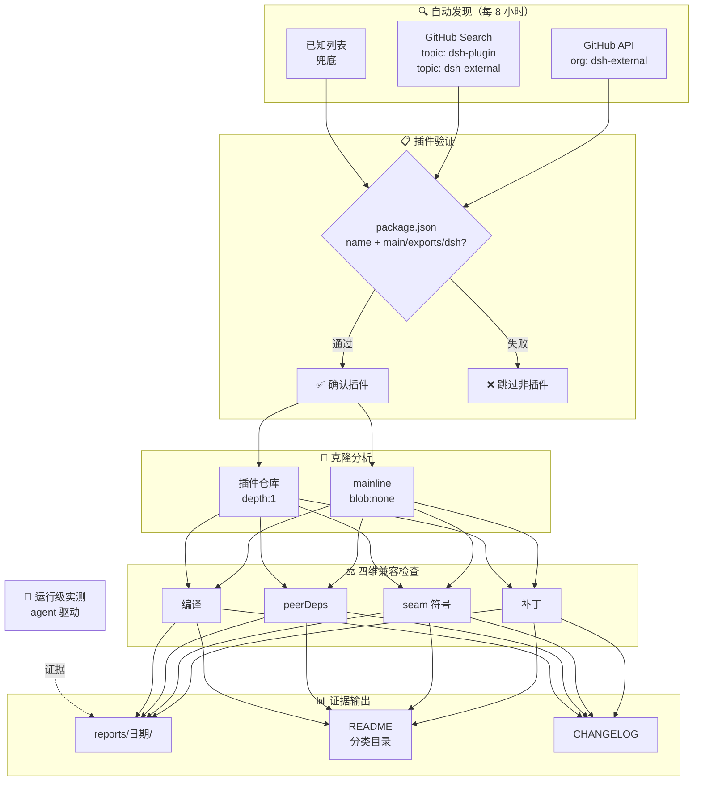

# Awesome DSH Plugins

**自动发现、证据验证的 DeepSeek Harness 插件生态雷达。**
安装前就知道哪个插件能用、哪个要改。

   

简体中文 | [English](README.en-US.md)

---

> 收录 288 个 DSH 插件仓库（clone 验证 package.json），其中 5 个有运行级测试记录。

## 工作原理

## 快速导航

| 你的目标 | 跳转入口 |
|---|---|
| 看热门插件 | [🔥 Star Top 20](#-热门插件star-top-20) |
| 按用途找一个插件 | [📋 分类目录](#分类目录) · [PLUGINS.md](PLUGINS.md) — 9 大功能领域 + 兼容性状态 |
| 浏览自动发现的全部仓库 | [📊 当前生态快照](#当前生态快照) — 日期化兼容矩阵 |
| 了解最近发生了什么 | [📝 CHANGELOG](CHANGELOG.md) |
| 登记或提交插件 | [🔧 给插件开发者](#给插件开发者) · 加 `dsh-plugin` topic → 8h 自动收录 · [PR 模板](.github/PULL_REQUEST_TEMPLATE.md) |
| 维护本雷达 | [⚙️ 自动化 SOP](docs/SOP.md) |
| 给插件使用者指南 | [📖 给插件使用者](#给插件使用者) |
| 本仓库如何判定兼容性 | [🔍 本仓库如何判定](#本仓库如何判定) |
| 加入社群交流 | [💬 DSH 学习社区](#-dsh-学习社区-dshfindcom) · [微信交流群](#微信交流群) |

> [!IMPORTANT]
> **收录不等于兼容，静态检查不等于运行可用，运行可用也不等于安全审计。**
> 本仓库提供可追溯的筛选信号，不代表 DSH 官方背书。安装第三方插件前，请检查插件源码、权限、依赖、许可证及测试日期。

## 🔥 热门插件（Star Top 20）

<!-- AUTO:featured:START -->

> 按 GitHub star 数排序，每 8 小时自动刷新。数据截至 2026-08-14 13:24。

| # | 插件 | ⭐ | 说明 |
|---|---|---|---|
| 1 | [dsh-web-ui](https://github.com/dsh-external/dsh-web-ui) | 987 | Plugin and skin collection for DeepSeek Harness (DSH) Web UI |
| 2 | [dsh-TUI](https://github.com/ccch1mneyyy/dsh-TUI) | 524 | Claude Code 风格全屏交互终端插件：像素鲸鱼顶栏、实时工作状态行、思考流式展开、双击 Esc 回滚 |
| 3 | [DSH-better-sidebar](https://github.com/dsh-external/DSH-better-sidebar) | 408 | 一个侧边栏的完整工作台，支持三方拓展注册新Tab页面，内置文件渲染编辑/终端/Git/子代理 |
| 4 | [dsh-ads](https://github.com/dsh-external/dsh-ads) | 213 | 是兄弟就来蹬我！DSH Web UI 广告：2005 年中文站点风格的侧栏广告 / 对话内信息流 / 角落弹窗 + 一个 |
| 5 | [oh-dsh-desktop](https://github.com/dsh-external/oh-dsh-desktop) | 100 | 一站式 DeepSeek Harness 社区发行版：TUI、桌面端与 Web UI 三种形态统一体验，支持分层安装、一 |
| 6 | [dsh-code](https://github.com/dsh-external/dsh-code) | 95 | dsh-tianshu-tui — DeepSeek Harness terminal UI |
| 7 | [whale-girl](https://github.com/dsh-external/whale-girl) | 65 | DSH Web GUI 桌面宠物插件（QQ 宠物形态）：右下角悬浮、可拖拽/投喂/玩耍的积累型伙伴 |
| 8 | [dsh-browser](https://github.com/dsh-external/dsh-browser) | 51 | dsh plugin: Chrome sidebar extension that lets DSH operate y |
| 9 | [dsh-openpencil](https://github.com/dsh-external/dsh-openpencil) | 49 | OpenPencil design preview and editing plugin for DSH |
| 10 | [dsh_workflow](https://github.com/dsh-external/dsh_workflow) | 46 | 把Claude Code的UltraCode模式带给DSH，把 DSH 的一次性多 Agent 调度，升级为可生成、可保 |
| 11 | [dsh-memory-evolve](https://github.com/dsh-external/dsh-memory-evolve) | 26 | 为 DeepSeek Harness 带来「跨会话长期记忆 + 后台自我进化」能力的纯插件实现：五轨记忆 · git 分 |
| 12 | [dsh-annotation](https://github.com/dsh-external/dsh-annotation) | 25 | DSH Web 选中批注插件：选文字→批注→回车随消息发送；气泡隐藏批注块（零闪烁）；回复按 Annotation N  |
| 13 | [ui-status-label](https://github.com/dsh-external/ui-status-label) | 24 | 把你鲸鱼娘思考时的 deep diving 自定义成任意你想要的样子 |
| 14 | [dsh-multica-runtime](https://github.com/dsh-external/dsh-multica-runtime) | 22 | Support dsh runtime on Multica. |
| 15 | [dsh-message-edit](https://github.com/dsh-external/dsh-message-edit) | 14 | DSH plugin: branch-based message editing, reroll, retry, ver |
| 16 | [dsh-ui-whale](https://github.com/dsh-external/dsh-ui-whale) | 14 | 【求⭐】🐋DSH Web UI 全手绘像素鲸鱼伙伴插件：会话标题栏常驻，平时眨眼/偶尔摆尾/动胸鳍，思考运行时持续动起来 |
| 17 | [dsh-vision](https://github.com/dsh-external/dsh-vision) | 14 | dsh 插件：给纯文本 DeepSeek 加视觉——view_image 工具桥接任意 OpenAI 兼容 VLM（默认 |
| 18 | [distill](https://github.com/dsh-external/distill) | 13 | 自动对话蒸馏：后台 subagent 反省 + 技能 create/update |
| 19 | [dsh-share](https://github.com/dsh-external/dsh-share) | 12 | dsh对话分享插件，一键分享你的对话 |
| 20 | [dsh-plugin-check](https://github.com/dsh-external/dsh-plugin-check) | 11 | DSH 插件健康检查工具：扫描插件仓库的清单协议 / patch 格式 / 构建陷阱 / hub 收录状态，零依赖只读， |

<!-- AUTO:featured:END -->

## 分类目录

<!-- AUTO:catalog:START -->

> 按功能领域分类（重分类修正）。点击标题展开，全部条目一次显示。

<h3>🔌 Web UI 增强（44）</h3>

*界面与交互增强插件：侧边栏、输入框、皮肤主题、面板 dock、消息显示、状态栏与可视化，让 Web 界面更顺手更好看*

| 插件 | 类型 | 兼容性 | 说明 |
|---|---|---|---|
| [dsh-input-history](https://github.com/dsh-external/dsh-input-history) | 插件 | 兼容 | DSH Web 输入历史插件：Ctrl+Up / Ctrl+Down 像终端一样召回与切换已发送消息，零核心改动 |
| [dsh-paste-input](https://github.com/dsh-external/dsh-paste-input) | 插件 | 兼容 | DSH WebUI 文件输入增强：Ctrl+V 粘贴（带首次告知弹窗）+ 拖拽 + 选择文件，发送时复制进会话工作区临时目录 |
| [review-panel](https://github.com/dsh-external/review-panel) | 社区 | 兼容 | Internal beta review panel for DeepSeek Harness |
| [chat-width](https://github.com/dsh-external/chat-width) | 插件 | 关注 | 自由调节正文和输入框的展示宽度 |
| [dsh-live-stats](https://github.com/dsh-external/dsh-live-stats) | 插件 | 关注 | Live input/output token estimates and generation TPS for DSH Web |
| [dsh-skins](https://github.com/dsh-external/dsh-skins) | 合集 | 关注 | DSH Web 换肤插件仓库：官方 ThemeService 第三方皮肤（token + AI 生图背景），零核心改动 |
| [dsh-vision](https://github.com/dsh-external/dsh-vision) | 插件 | 关注 | dsh 插件：给纯文本 DeepSeek 加视觉——view_image 工具桥接任意 OpenAI 兼容 VLM（默认智谱免费档，实测 4 厂商 10 模型） |
| [dsh-web-ui](https://github.com/dsh-external/dsh-web-ui) | 合集 | 关注 | Plugin and skin collection for DeepSeek Harness (DSH) Web UI - task board, git g |
| [ex-setting](https://github.com/dsh-external/ex-setting) | 插件 | 关注 | DSH的设置扩展 |
| [web-components](https://github.com/dsh-external/web-components) | 基建 | 关注 | web-components支持 |
| [dsh-question-collapse](https://github.com/dsh-external/dsh-question-collapse) | 插件 | 需适配 | DSH WebUI 提问栏折叠插件：保留问题标题与取消按钮，展开后保留未提交草稿 |
| [dsh-split-panes](https://github.com/dsh-external/dsh-split-panes) | 插件 | 需适配 | — |
| [dsh-tps](https://github.com/dsh-external/dsh-tps) | 插件 | 需适配 | 只是一个 tps 插件 |
| [turtle-ui](https://github.com/dsh-external/turtle-ui) | 插件 | 需适配 | as is, no warranty |
| [7d7d](https://github.com/dsh-external/7d7d) | 插件 | 待调研 | 7k7d 游戏门户 —— 7k7k 风格 DSH 小游戏平台：模型生成/上传 HTML5 与 Flash 小游戏，Web UI 内直接游玩（Ruffle 模拟  |
| [dsh-ads](https://github.com/dsh-external/dsh-ads) | 插件 | 待调研 | 是兄弟就来蹬我！DSH Web UI 广告：2005 年中文站点风格的侧栏广告 / 对话内信息流 / 角落弹窗 + 一个真实热区比视觉小得多的关闭叉 |
| [dsh-aigc-canvas](https://github.com/dsh-external/dsh-aigc-canvas) | 插件 | 待调研 | — |
| [dsh-annotation](https://github.com/dsh-external/dsh-annotation) | 插件 | 待调研 | DSH Web 选中批注插件：选文字→批注→回车随消息发送；气泡隐藏批注块（零闪烁）；回复按 Annotation N 逐条对照（可悬浮芯片） |
| [dsh-anti-ads](https://github.com/dsh-external/dsh-anti-ads) | 插件 | 待调研 | — |
| [DSH-better-sidebar](https://github.com/dsh-external/DSH-better-sidebar) | 插件 | 待调研 | 一个侧边栏的完整工作台，支持三方拓展注册新Tab页面，内置文件渲染编辑/终端/Git/子代理 |
| [dsh-browser-panel](https://github.com/dsh-external/dsh-browser-panel) | 插件 | 待调研 | WebUI 内嵌完整有头浏览器视图插件：模型在 DSH WebUI 内实时操控真实浏览器，用户可见每一步（Codex 式体验，0 视觉依赖） |
| [dsh-custom-css](https://github.com/dsh-external/dsh-custom-css) | 插件 | 待调研 | — |
| [dsh-deepcel](https://github.com/dsh-external/dsh-deepcel) | 合集 | 待调研 | 一款模仿 excel 的 dsh 皮肤 |
| [dsh-drag-and-drop](https://github.com/dsh-external/dsh-drag-and-drop) | 插件 | 待调研 | 为 DSH Web UI 增加跨平台文件拖拽与原始路径插入能力，无需复制文件 |
| [dsh-genui](https://github.com/dsh-external/dsh-genui) | 插件 | 待调研 | DSH的生成式UI能力,不断更新中,欢迎issue&pr! |
| [dsh-island](https://github.com/dsh-external/dsh-island) | 基建 | 待调研 | DSH Dynamic Island — macOS notch panel for DSH；macOS 上的 codeisland 复刻 |
| [dsh-message-edit](https://github.com/dsh-external/dsh-message-edit) | 插件 | 待调研 | DSH plugin: branch-based message editing, reroll, retry, version timeline |
| [dsh-selection-chat](https://github.com/dsh-external/dsh-selection-chat) | 插件 | 待调研 | DSH WebUI plugin: select conversation text → add to composer (no auto-send) / vi |
| [dsh-side-panel](https://github.com/dsh-external/dsh-side-panel) | 插件 | 待调研 | DSH 侧边栏，集成文件浏览器、终端和 Git 审查，方便预览文件 |
| [dsh-tavern-plugin](https://github.com/dsh-external/dsh-tavern-plugin) | 插件 | 待调研 | 小酒馆 (Tavern) plugin — character cards, chat, memories & moments (朋友圈) |
| [DSH-UI4A](https://github.com/dsh-external/DSH-UI4A) | 插件 | 待调研 | UI4A(UI for Agent)的DSH实现 https://macaron.im/blog/macaron-ui4a-interactive-ai |
| [dsh-ultra-ui](https://github.com/dsh-external/dsh-ultra-ui) | 插件 | 待调研 | — |
| [dsh-visualize](https://github.com/dsh-external/dsh-visualize) | 插件 | 待调研 | DSH 对话内生成式 UI 插件：模型把交互式 HTML 卡片直接画进会话流——visualize 工具 + 配套 skill + 沙箱渲染卡，带流式预览、组件 |
| [dsh-voice-chat](https://github.com/dsh-external/dsh-voice-chat) | 插件 | 待调研 | 实时语音对话插件：WebUI 内语音输入/输出，边说话边编程（vibe coding），0 打字 |
| [dsh-web-panel](https://github.com/dsh-external/dsh-web-panel) | 插件 | 待调研 | DSH Web UI 内嵌交互式终端插件（dsh-external/issues#111）：支持底部终端和有侧边栏代码审查，xterm.js + node-pt |
| [dsh-web-review](https://github.com/dsh-external/dsh-web-review) | 插件 | 待调研 | — |
| [show-bash-command](https://github.com/dsh-external/show-bash-command) | 插件 | 待调研 | 显示命令具体内容而不是描述 |
| [ui-status-label](https://github.com/dsh-external/ui-status-label) | 插件 | 待调研 | 把你鲸鱼娘思考时的 deep diving 自定义成任意你想要的样子 |
| [ya-workspace-sidebar](https://github.com/dsh-external/ya-workspace-sidebar) | 插件 | 待调研 | — |
| [zephyr](https://github.com/dsh-external/zephyr) | 基建 | 待调研 | deepseek harness composer |
| [dsh-ui-webview](https://github.com/dsh-external/dsh-ui-webview) | 插件 | 占位 | — |
| [group-chat-diary](https://github.com/dsh-external/group-chat-diary) | 社区 | 不适用 | DSH 内测群聊日记归档 |
| [dsh-chat](https://github.com/dsh-external/dsh-chat) | 插件 | 已删除 | DSH 对话插件：对话视图增强 |
| [dsh-web](https://github.com/dsh-external/dsh-web) | 插件 | 已删除 | DSH Web 插件：Web UI 增强 |

*界面与交互增强插件：侧边栏、输入框、皮肤主题、面板 dock、消息显示、状态栏与可视化，让 Web 界面更顺手更好看*

<h3>🤖 Agent 能力（61）</h3>

*增强 agent 本身的能力：子代理管理、记忆与上下文、会话控制、规划执行、唤醒/睡眠、提示词与技能注入*

| 插件 | 类型 | 兼容性 | 说明 |
|---|---|---|---|
| [dsh-prompt-studio](https://github.com/dsh-external/dsh-prompt-studio) | 插件 | 兼容 | DSH plugin: edit user and built-in system-prompt sections with live preview (Pro |
| [dsh-track](https://github.com/dsh-external/dsh-track) | 插件 | 兼容 | DSH Track Bridge 插件：嵌入式任务管理引擎——决策点协议、念头捕获墙、Linear 形 issue 存储（bundle），AI 与人之间的任务轨 |
| [dsh-ui-progress](https://github.com/dsh-external/dsh-ui-progress) | 插件 | 兼容 | DSH Web UI 会话进度插件：输入框停靠区常驻会话进度条（todos 真实进度 / 实时 token 生成速率 / 中断橘红态 / 待办提醒），零核心改动 |
| [Recall](https://github.com/dsh-external/Recall) | 基建 | 兼容 | Switch agents. Keep the memory. Local-first search across your AI coding session |
| [distill](https://github.com/dsh-external/distill) | 插件 | 关注 | 自动对话蒸馏：后台 subagent 反省 + 技能 create/update |
| [dsh-agent-session-sources](https://github.com/dsh-external/dsh-agent-session-sources) | 合集 | 关注 | This repository contains the provider-neutral agent-session dock plus its Claude |
| [dsh-alphasolve](https://github.com/dsh-external/dsh-alphasolve) | 插件 | 关注 | Session-scoped AlphaSolve workflow for DeepSeek Harness |
| [dsh-skills-manager](https://github.com/dsh-external/dsh-skills-manager) | 插件 | 关注 | 在webui中方便的列出、禁用启用、编辑skills |
| [dsh-slice-agent-loop](https://github.com/dsh-external/dsh-slice-agent-loop) | 插件 | 关注 | A drop-in DeepSeek Harness agent loop whose context engine is a bounded slice in |
| [Qwen-MM-Plugins](https://github.com/dsh-external/Qwen-MM-Plugins) | 合集 | 关注 | Qwen-MM-Plugins支持 |
| [dsh-cot-summary](https://github.com/dsh-external/dsh-cot-summary) | 合集 | 需适配 | 啊哈哈哈哈，最后一天了，我要总结cot！ |
| [dsh-subagent-tree](https://github.com/dsh-external/dsh-subagent-tree) | 插件 | 需适配 | DSH 工作区侧栏树子代理分支插件（会话行扩展 hole）— 非官方，版权归作者 |
| [deep-standard-skill](https://github.com/dsh-external/deep-standard-skill) | 技能 | 待调研 | 把工程规范从没人读的文档变成会拒绝违规的程序 |
| [dsh_workflow](https://github.com/dsh-external/dsh_workflow) | 插件 | 待调研 | 把Claude Code的UltraCode模式带给DSH，把 DSH 的一次性多 Agent 调度，升级为可生成、可保存、可治理、可观察、可恢复的 Workf |
| [dsh-a2a](https://github.com/dsh-external/dsh-a2a) | 插件 | 待调研 | Agent2Agent mesh for the Harness |
| [dsh-activity-plugin](https://github.com/dsh-external/dsh-activity-plugin) | 插件 | 待调研 | — |
| [dsh-agent-budget](https://github.com/dsh-external/dsh-agent-budget) | 插件 | 待调研 | Native Harness agent-tree token budget plugin |
| [dsh-agent-rp](https://github.com/dsh-external/dsh-agent-rp) | 插件 | 待调研 | SillyTavern migration and next-generation Agent RP for DSH |
| [dsh-auto-approval](https://github.com/dsh-external/dsh-auto-approval) | 插件 | 待调研 | — |
| [dsh-checkpoint](https://github.com/dsh-external/dsh-checkpoint) | 插件 | 待调研 | Mark an exploration start in the session; pairs with rewind to fold the explorat |
| [dsh-client-ui-plan-execute](https://github.com/dsh-external/dsh-client-ui-plan-execute) | 插件 | 待调研 | DSH Web 设置页「规划/执行模型」设置行插件：编辑 dsh-plan-execute 双模型路由（官方 dsh-client-* bundle） |
| [dsh-deeplink](https://github.com/dsh-external/dsh-deeplink) | 插件 | 待调研 | DSH WebUI 深链插件：?session=/?workspace= 直接打开指定项目对话 |
| [dsh-design](https://github.com/dsh-external/dsh-design) | 插件 | 待调研 | DSH-native Web/UI design Agent bundle for Create, Recreate, Refine, bounded visu |
| [dsh-easy-ctx-manager](https://github.com/dsh-external/dsh-easy-ctx-manager) | 插件 | 待调研 | 一个适用于dsh的上下文管理插件，包含上下文节省，注意力优化，压缩档案馆等功能 |
| [dsh-engram-relay](https://github.com/dsh-external/dsh-engram-relay) | 插件 | 待调研 | 外置 engram 转接模型插件：内置 <1B 模型（transformers.js/ONNX），为 DSH 主模型实现超长记忆（100k 上下文等效延展 ≥1 |
| [dsh-evolve](https://github.com/dsh-external/dsh-evolve) | 插件 | 待调研 | 自进化插件：agent 在 session 内随对话给自己长出/剪掉能力 —— evolve_add 热挂载持久化 cordis 插件（下一 step 工具即可 |
| [dsh-explain](https://github.com/dsh-external/dsh-explain) | 插件 | 待调研 | DSH 本地优先学习模式插件：跨会话全局学习线程、按来源讲解、ExplainContext、压缩与可诊断设置界面 |
| [dsh-focus-chat](https://github.com/dsh-external/dsh-focus-chat) | 插件 | 待调研 | 为 dsh 提供新的「聚焦会话」精简会话视图，更轻松易于阅读，只关注最终产出结果 |
| [dsh-inspect](https://github.com/dsh-external/dsh-inspect) | 插件 | 待调研 | 发现问题(checkup) → 修复交付(fix) → 质量复查(review) 的对抗式闭环插件：基于官方 workflow 引擎的检查/修复/复查工具集 |
| [dsh-issue-like-skill](https://github.com/dsh-external/dsh-issue-like-skill) | 技能 | 待调研 | dsh-issue-like skill: react 👍 to DSH issues on dsh-external/issues (org-internal |
| [dsh-kimi-bridge](https://github.com/dsh-external/dsh-kimi-bridge) | 插件 | 待调研 | — |
| [dsh-llm-fallbacks](https://github.com/dsh-external/dsh-llm-fallbacks) | 插件 | 待调研 | An dsh plugin for role-based LLM retry&fallback strategy. 基于角色的模型重试备用策略插件 |
| [dsh-mega](https://github.com/dsh-external/dsh-mega) | 合集 | 待调研 | dsh 整合包：精选插件一行安装（loop / task-status / plugin-console） |
| [dsh-mnemon](https://github.com/dsh-external/dsh-mnemon) | 插件 | 待调研 | Mnemon 与 DSH 的深度集成插件，为 DSH 提供完备的本地记忆系统：运行时记忆、可检索档案与受监督记忆体 |
| [dsh-nowledge-mem](https://github.com/dsh-external/dsh-nowledge-mem) | 插件 | 待调研 | DSH plugin for Nowledge Mem™ |
| [dsh-openmaic](https://github.com/dsh-external/dsh-openmaic) | 插件 | 待调研 | Generate OpenMAIC classrooms (interactive AI lessons) and return a playable clas |
| [dsh-plan-execute](https://github.com/dsh-external/dsh-plan-execute) | 插件 | 待调研 | DSH plan/execute 双模型路由插件：plan 模式用规划模型（推理型），批准后自动切执行模型（快速型）；settings.yaml 与 Web 设 |
| [dsh-qq2006](https://github.com/dsh-external/dsh-qq2006) | 插件 | 待调研 | DSH (DeepSeek Harness) QQ2006 skin plugin: theme registration + global skin shee |
| [dsh-reuse-first](https://github.com/dsh-external/dsh-reuse-first) | 技能 | 待调研 | — |
| [dsh-rewind](https://github.com/dsh-external/dsh-rewind) | 插件 | 待调研 | Fold everything since the last checkpoint mark into an auto-generated report, re |
| [dsh-scout](https://github.com/dsh-external/dsh-scout) | 插件 | 待调研 | 面向 DeepSeek Harness 的只读环境探测插件，为智能体提供运行环境、软件版本、系统资源、端口、服务、硬件及工作区信息 |
| [dsh-self-control-guard](https://github.com/dsh-external/dsh-self-control-guard) | 插件 | 待调研 | DSH self-control guard: intercept host-kill attempts from bash, teach the contro |
| [dsh-session-cluster](https://github.com/dsh-external/dsh-session-cluster) | 插件 | 待调研 | Same-machine cross-session messaging for DeepSeek Harness (DSH) — the DSH analog |
| [dsh-session-health](https://github.com/dsh-external/dsh-session-health) | 插件 | 待调研 | DSH 会话健康检查插件：多帧 zstd 会话文件的帧级扫描诊断（torn/损坏/空会话检测），零依赖只读，注册 session_health 工具 |
| [dsh-session-repair-skill](https://github.com/dsh-external/dsh-session-repair-skill) | 技能 | 待调研 | Detect and repair corrupted dsh session history logs (multi-client concurrent-wr |
| [dsh-skill-session-recovery](https://github.com/dsh-external/dsh-skill-session-recovery) | 技能 | 待调研 | DSH 会话丢失事故的定位/无损修复/安全重启 skill：诊断 corrupt session log、修复帧结构、重启前 handoff 纪律 |
| [dsh-skill-stats](https://github.com/dsh-external/dsh-skill-stats) | 插件 | 待调研 | 技能调用统计插件：历史回放 + 实时订阅，统计每个技能的调用次数、会话分布与调用时间线；会话 Tab + 设置面板双视图，SVG 趋势图、已删除标记，辅助技能清 |
| [dsh-sleep](https://github.com/dsh-external/dsh-sleep) | 插件 | 待调研 | — |
| [dsh-super-injector](https://github.com/dsh-external/dsh-super-injector) | 插件 | 待调研 | — |
| [dsh-turn-navigator](https://github.com/dsh-external/dsh-turn-navigator) | 插件 | 待调研 | Private DSH Web turn navigation plugin |
| [dsh-turn-rewind](https://github.com/dsh-external/dsh-turn-rewind) | 插件 | 待调研 | Turn Rewind for DSH — rewind conversation and workspace state, powered by a pers |
| [dsh-web-workflow-visualizer](https://github.com/dsh-external/dsh-web-workflow-visualizer) | 插件 | 待调研 | DSH Web GUI 的 Workflow 可视化 + 图工程插件：多 agent 动态工作流的白板化编辑与脚本生成 |
| [mstar-workflow](https://github.com/dsh-external/mstar-workflow) | 插件 | 待调研 | A Skill-driven Harness/Loop Engineering Workflow Agent Plugin |
| [session-teleport](https://github.com/dsh-external/session-teleport) | 插件 | 待调研 | PostgreSQL-backed single-writer session handoff plugin for DeepSeek Harness |
| [yet-another-subagent](https://github.com/dsh-external/yet-another-subagent) | 插件 | 待调研 | — |
| [dsh-oauth-mcp-client](https://github.com/springbrand-lab/dsh-oauth-mcp-client) | 插件 | 待调研 | OAuth 2.1 Streamable HTTP MCP client plugin for DeepSeek Harness. |
| [falsify-dsh](https://github.com/shi275773124/falsify-dsh) | 插件 | 待调研 | DeepSeek Harness adapter for the public Falsify CLI. Adjudicator receipt, not a  |
| [billion-context-dsh](https://github.com/Tyan66666/billion-context-dsh) | 插件 | 待调研 | Model-driven context management (Active Context Pruning / ACP) for the DeepSeek  |
| [dsh-session-hub](https://github.com/dsh-external/dsh-session-hub) | 插件 | 占位 | 跨工具会话互通插件：把 opencode / Claude Code / Antigravity 的历史会话显示在 DSH 侧边栏，点击即导入为原生会话（只读源 |
| [dsh-superpowers](https://github.com/dsh-external/dsh-superpowers) | 插件 | 占位 | Reserved DSH integration for Superpowers: reusable agent skills and structured s |
| [dsh-memory](https://github.com/dsh-external/dsh-memory) | 插件 | 已删除 | DSH 记忆插件：跨会话长期记忆与自我进化 |

*增强 agent 本身的能力：子代理管理、记忆与上下文、会话控制、规划执行、唤醒/睡眠、提示词与技能注入*

<h3>💻 编码开发（38）</h3>

*面向编程场景的工具：代码操作、git 集成、终端、diff 与编辑器、文档生成、语言支持与构建辅助*

| 插件 | 类型 | 兼容性 | 说明 |
|---|---|---|---|
| [dsh-bash-encoding](https://github.com/dsh-external/dsh-bash-encoding) | 插件 | 兼容 | DSH bash 输出编码自动识别插件：替换 ctx.bash，自管 spawn 收集原始字节，自动检测 UTF-16LE/UTF-8/GBK 编码并正确解码， |
| [dsh-gh-bridge](https://github.com/dsh-external/dsh-gh-bridge) | 插件 | 兼容 | DSH plugin: bridge the macOS Keychain GitHub token into gh hosts.yml so the sand |
| [dsh-memory-evolve](https://github.com/dsh-external/dsh-memory-evolve) | 插件 | 兼容 | 为 DeepSeek Harness 带来「跨会话长期记忆 + 后台自我进化」能力的纯插件实现：五轨记忆 · git 分支感知 · 回合内自我审查 · 技能自我 |
| [dsh-pi-adapter](https://github.com/dsh-external/dsh-pi-adapter) | 插件 | 兼容 | Run pi coding-agent extensions (ExtensionAPI) inside DeepSeek Harness via a cord |
| [dsh-pty-windows](https://github.com/dsh-external/dsh-pty-windows) | 插件 | 兼容 | Marisa 插件：Windows PTY 进程检查器（PowerShell CIM 枚举 + kill 存活探针） |
| [dsh-shell-windows](https://github.com/dsh-external/dsh-shell-windows) | 插件 | 兼容 | Marisa 插件：Windows PowerShell 外壳适配器（ctx.shell，win32） |
| [dsh-cc-tui](https://github.com/dsh-external/dsh-cc-tui) | 插件 | 关注 | Claude Code 风格全屏交互终端插件：像素鲸鱼顶栏、流光大字、思考流式展开、双击 Esc 回滚、蓝白上下文进度条 + TPS 仪表 |
| [dsh-github-integration](https://github.com/dsh-external/dsh-github-integration) | 合集 | 关注 | DSH GitHub integration plugin |
| [dsh-my-rsi](https://github.com/dsh-external/dsh-my-rsi) | 合集 | 关注 | Evidence-driven RSI experiments and Cordis plugins for DeepSeek Harness |
| [dsh-tool-browser](https://github.com/dsh-external/dsh-tool-browser) | 合集 | 关注 | Private toybox snapshot of the DeepSeek Harness SDK (0804 base + browser-control |
| [dsh-tool-calculator](https://github.com/dsh-external/dsh-tool-calculator) | 插件 | 关注 | DSH 计算器工具插件：安全的数学表达式求值器，零依赖递归下降解析器 |
| [dsh-tool-time](https://github.com/dsh-external/dsh-tool-time) | 插件 | 关注 | DSH 时间工具插件：严格 ISO 8601 解析、IANA 时区转换、UTC 日历运算、固定时长差，零依赖 |
| [dsh-working-activity](https://github.com/dsh-external/dsh-working-activity) | 插件 | 需适配 | DSH 实时模型工作状态行：俏皮思考文案、运行中的工具、回合总结、自我叙述（⏵）— 用于 TUI 提示栏与 Web UI |
| [cross-harness-cite](https://github.com/dsh-external/cross-harness-cite) | 插件 | 待调研 | 支持跨Harness引用codex/claude code的历史对话 |
| [dsh-auto-blame](https://github.com/dsh-external/dsh-auto-blame) | 插件 | 待调研 | — |
| [dsh-better-sidebar-plugin-office](https://github.com/dsh-external/dsh-better-sidebar-plugin-office) | 插件 | 待调研 | — |
| [dsh-cc-connect](https://github.com/dsh-external/dsh-cc-connect) | 插件 | 待调研 | 通过cc connect远程使用dsh |
| [dsh-code](https://github.com/dsh-external/dsh-code) | 插件 | 待调研 | dsh-tianshu-tui — DeepSeek Harness terminal UI |
| [dsh-code-map](https://github.com/dsh-external/dsh-code-map) | 插件 | 待调研 | DSH 代码地图插件：symbol 索引 / 文档符号 / 调用层级 / 继承树——给模型补上「地图型」语义查询（LSP 之上，零 SDK 依赖） |
| [dsh-codex-bridge](https://github.com/dsh-external/dsh-codex-bridge) | 插件 | 待调研 | — |
| [dsh-git-identity](https://github.com/dsh-external/dsh-git-identity) | 插件 | 待调研 | DSH 插件：git 提交固定使用环境自身作者身份（优先 gh CLI 登录账号，GitHub noreply 邮箱），GIT_AUTHOR_*/GIT_COM |
| [dsh-grok-tui](https://github.com/dsh-external/dsh-grok-tui) | 插件 | 待调研 | Use dsh via grok-build's TUI. |
| [dsh-interpreters](https://github.com/dsh-external/dsh-interpreters) | 插件 | 待调研 | — |
| [dsh-latex](https://github.com/dsh-external/dsh-latex) | 插件 | 待调研 | DSH LaTeX 插件：agent 写 LaTeX 文档 → 一键编译 PDF（复用本机 Windows TeX Live）→ 结构化定位错误 → 右侧面板预 |
| [dsh-office](https://github.com/dsh-external/dsh-office) | 插件 | 待调研 | — |
| [dsh-tool-search](https://github.com/dsh-external/dsh-tool-search) | 插件 | 待调研 | Per-agent on-demand tool discovery and progressive schema disclosure for DeepSee |
| [dsh-tool-stat](https://github.com/dsh-external/dsh-tool-stat) | 插件 | 待调研 | DSH 统计工具插件：描述统计/百分位数/频数分布/相关性，零依赖纯函数确定性 |
| [dsh-trace](https://github.com/dsh-external/dsh-trace) | 基建 | 待调研 | DeepSeek Harness telemetry backend that exports turns, model steps, and tool cal |
| [dsh-tui-front-door](https://github.com/dsh-external/dsh-tui-front-door) | 插件 | 待调研 | Standalone dsh TUI front door: ink REPL + keybindings engine + session seams |
| [dsh-vscode](https://github.com/dsh-external/dsh-vscode) | 基建 | 待调研 | Native VS Code chat integration for DeepSeek Harness |
| [official-plugins-port](https://github.com/dsh-external/official-plugins-port) | 合集 | 待调研 | Official Claude Code / Codex plugins ported to the DSH plugin protocol (23 plugi |
| [zotero-wave-rag](https://github.com/dsh-external/zotero-wave-rag) | 插件 | 待调研 | 面向 Zotero 论文库的浪潮式 RAG 细节检索系统 —— DSH 外部插件 |
| [dsh-claude-move](https://github.com/PerryLink/dsh-claude-move) | 插件 | 待调研 | DeepSeek Harness (dsh) plugin: migrate Claude Code sessions, memory, skills and  |
| [dsh-TUI](https://github.com/ccch1mneyyy/dsh-TUI) | 插件 | 待调研 | Claude Code 风格全屏交互终端插件：像素鲸鱼顶栏、实时工作状态行、思考流式展开、双击 Esc 回滚 |
| [dsh-build](https://github.com/dsh-external/dsh-build) | 插件 | 占位 | dsh-build |
| [dsh-spec-kit](https://github.com/dsh-external/dsh-spec-kit) | 插件 | 占位 | Reserved DSH integration for GitHub Spec Kit: spec-driven requirements, planning |
| [dsh-tui](https://github.com/dsh-external/dsh-tui) | 基建 | 占位 | — |
| [dsh_ide](https://github.com/dsh-external/dsh_ide) | 插件 | 已删除 | DSH IDE 大工程：集成开发环境方向（编辑器/工程视图/调试） |

*面向编程场景的工具：代码操作、git 集成、终端、diff 与编辑器、文档生成、语言支持与构建辅助*

<h3>📡 消息通讯（19）</h3>

*把 dsh 接入各类沟通渠道：微信/QQ/Telegram/飞书机器人、桌面通知、消息分享与跨端回复*

| 插件 | 类型 | 兼容性 | 说明 |
|---|---|---|---|
| [dsh-chat-thumb](https://github.com/dsh-external/dsh-chat-thumb) | 插件 | 兼容 | Chat缩略图 |
| [dsh-feishu-bot](https://github.com/dsh-external/dsh-feishu-bot) | 渠道 | 兼容 | Feishu remote channel for DeepSeek Harness |
| [dsh-wecom-bot](https://github.com/dsh-external/dsh-wecom-bot) | 渠道 | 兼容 | Wecom remote channel for DeepSeek Harness |
| [dsh-weixin-bot](https://github.com/dsh-external/dsh-weixin-bot) | 渠道 | 兼容 | WeiXin remote channel for DeepSeek Harness |
| [qqbot](https://github.com/dsh-external/qqbot) | 渠道 | 兼容 | QQ remote channel for DeepSeek Harness |
| [telegram](https://github.com/dsh-external/telegram) | 渠道 | 关注 | Telegram Bot API 桥接插件：长轮询、per-chat 会话、HTML 格式化 |
| [tg-bot](https://github.com/dsh-external/tg-bot) | 渠道 | 关注 | Telegram remote channel for DeepSeek Harness |
| [dsh-club](https://github.com/dsh-external/dsh-club) | 插件 | 待调研 | DSH 俱乐部 — DeepSeek Harness 内测用户排行榜(每日自动采集) |
| [dsh-deep-research](https://github.com/dsh-external/dsh-deep-research) | 插件 | 待调研 | Adaptive deep-research orchestrator plugin for DeepSeek Harness (official workfl |
| [dsh-feishu-notify](https://github.com/dsh-external/dsh-feishu-notify) | 插件 | 待调研 | 为dsh新增飞书的通知：会话结束/需要等待输入 |
| [dsh-ica](https://github.com/dsh-external/dsh-ica) | 渠道 | 待调研 | dsh 但是 icalingua 前端 |
| [dsh-share](https://github.com/dsh-external/dsh-share) | 插件 | 待调研 | dsh对话分享插件，一键分享你的对话 |
| [dsh-suggested-replies](https://github.com/dsh-external/dsh-suggested-replies) | 插件 | 待调研 | DSH Web 预测回复插件：AI 回复后在输入框上方生成可点击填入草稿的下一步消息候选 |
| [dsh-teamwork](https://github.com/dsh-external/dsh-teamwork) | 插件 | 待调研 | — |
| [dsh-web-ui-notify](https://github.com/dsh-external/dsh-web-ui-notify) | 插件 | 待调研 | 为 DSH 增加桌面通知提醒 |
| [dsh-webbridge](https://github.com/dsh-external/dsh-webbridge) | 插件 | 待调研 | DSH 结合 Kimi WebBridge |
| [dsh-telegram](https://github.com/ben7am1n/dsh-telegram) | 插件 | 待调研 | Telegram 远程渠道 |
| [dsh-coding-receipt](https://github.com/dsh-external/dsh-coding-receipt) | 基建 | 占位 | Turn a DeepSeek Harness session log into a local, shareable coding receipt |
| [issues](https://github.com/dsh-external/issues) | 社区 | 不适用 | 内测时遇到的问题 |

*把 dsh 接入各类沟通渠道：微信/QQ/Telegram/飞书机器人、桌面通知、消息分享与跨端回复*

<h3>🗂 文件数据（36）</h3>

*文件与数据处理：读写与格式转换、爬取抓取、数据库、编码识别、文档解析与知识库*

| 插件 | 类型 | 兼容性 | 说明 |
|---|---|---|---|
| [dsh-diff-viewer](https://github.com/dsh-external/dsh-diff-viewer) | 插件 | 兼容 | DSH Web GUI PiUI-style diff viewer plugin: replaces the stock DiffBlock for writ |
| [dsh-issue-filer](https://github.com/dsh-external/dsh-issue-filer) | 技能 | 兼容 | DSH 提 issue 技能：向 dsh-external/issues 自动查重、格式化并创建 issue，本地台账记录 |
| [dsh-multimedia-webui-input](https://github.com/dsh-external/dsh-multimedia-webui-input) | 插件 | 兼容 | Community multimedia file and folder input for DeepSeek Harness WebUI with send- |
| [session-persistence-rdb](https://github.com/dsh-external/session-persistence-rdb) | 插件 | 兼容 | session 关系型数据库持久化 |
| [dsh-artifact](https://github.com/dsh-external/dsh-artifact) | 插件 | 关注 | dsh 插件：文件交付协议——send_artifact 工具经 tool/result meta 携带结构化描述子，任意客户端可渲染 |
| [dsh-tool-encoding](https://github.com/dsh-external/dsh-tool-encoding) | 插件 | 关注 | DSH 编码/哈希工具插件：base64/base64url/url/hex 编解码、md5/sha1/sha256/sha512 哈希、UUID 生成，零依赖 |
| [dsh-tool-json](https://github.com/dsh-external/dsh-tool-json) | 插件 | 关注 | DSH JSON 查询工具插件：JMESPath 子集查询，零依赖递归下降解析器 |
| [session-chatlog](https://github.com/dsh-external/session-chatlog) | 插件 | 关注 | Marisa 插件：会话聊天记录读取工具（session_list / session_read_chat） |
| [context-doctor](https://github.com/dsh-external/context-doctor) | 插件 | 待调研 | DSH 上下文注入审计插件：统计 AGENTS.md 指令链/技能目录/工具 schema 的 token 成本，检测重复与冲突；Web UI 圆环面板 + c |
| [ds_web_craw](https://github.com/dsh-external/ds_web_craw) | 基建 | 待调研 | — |
| [dsh-advisor](https://github.com/dsh-external/dsh-advisor) | 插件 | 待调研 | Advisor - Pair a second model that passively reviews each turn and injects notes |
| [dsh-cyber-sec](https://github.com/dsh-external/dsh-cyber-sec) | 插件 | 待调研 | dsh 生态授权渗透测试 profile bundle：容器化 bash 执行（可降级本机）+ engagement 级技术授权 guard + SQLite  |
| [dsh-data-agent](https://github.com/dsh-external/dsh-data-agent) | 插件 | 待调研 | 让AI帮你连数据库、写SQL的DSH插件 |
| [dsh-find-plugins](https://github.com/dsh-external/dsh-find-plugins) | 技能 | 待调研 | — |
| [dsh-kb-sieve](https://github.com/dsh-external/dsh-kb-sieve) | 插件 | 待调研 | DSH knowledge-base plugin: build audit-able KB packs (references + SQLite FTS5)  |
| [dsh-loop](https://github.com/dsh-external/dsh-loop) | 插件 | 待调研 | DSH 插件：定时循环（/loop 命令 + loop 工具 + 活动状态条） |
| [dsh-mineru](https://github.com/dsh-external/dsh-mineru) | 插件 | 待调研 | DSH plugin exposing MineRU document parsing tools to the model |
| [dsh-navbar](https://github.com/dsh-external/dsh-navbar) | 插件 | 待调研 | DSH 插件：对话节点导航条（右缘节点串快速跳转 user 消息） |
| [dsh-notebooks](https://github.com/dsh-external/dsh-notebooks) | 插件 | 待调研 | — |
| [dsh-openpencil](https://github.com/dsh-external/dsh-openpencil) | 插件 | 待调研 | OpenPencil design preview and editing plugin for DSH |
| [dsh-profile-bundle-example](https://github.com/dsh-external/dsh-profile-bundle-example) | 合集 | 待调研 | Minimal script-free Profile Bundle example for DeepSeek Harness and OMDSH Regist |
| [dsh-stock-market](https://github.com/dsh-external/dsh-stock-market) | 插件 | 待调研 | 有效解决了写代码的时候账户不能同时亏钱的BUG |
| [dsh-task-status](https://github.com/dsh-external/dsh-task-status) | 插件 | 待调研 | DSH 插件：后台任务状态条（对话页任务进度 + 实时输出 tail） |
| [dsh-tool-csv](https://github.com/dsh-external/dsh-tool-csv) | 插件 | 待调研 | DSH CSV 数据工具插件：解析/查询/统计/转换 CSV 文本（RFC 4180），零依赖状态机解析器，注册 csv 工具 |
| [dsh-tool-diff](https://github.com/dsh-external/dsh-tool-diff) | 插件 | 待调研 | DSH Diff 工具插件：文本/JSON/CSV/Markdown 结构化比较与 unified diff，零依赖只读，注册 diff 工具 |
| [dsh-tool-markdown](https://github.com/dsh-external/dsh-tool-markdown) | 插件 | 待调研 | DSH Markdown 工具插件：HTML↔Markdown 转换、GFM 表格规范化、目录生成，零依赖轻量解析器，注册 markdown 工具 |
| [dsh-tool-regex](https://github.com/dsh-external/dsh-tool-regex) | 插件 | 待调研 | DSH 正则工具插件：测试匹配/提取捕获组/安全替换/静态解释正则（不执行代码），零依赖，注册 regex 工具 |
| [dsh-tool-schema](https://github.com/dsh-external/dsh-tool-schema) | 插件 | 待调研 | DSH JSON Schema 验证工具插件：validate/paths/explain/normalize，零网络零动态执行 |
| [dsh-toolkit](https://github.com/dsh-external/dsh-toolkit) | 合集 | 待调研 | DSH 零依赖工具包 collection —— time / encoding / json / calculator / csv / regex / mar |
| [dsh-vision-toolkit](https://github.com/dsh-external/dsh-vision-toolkit) | 插件 | 待调研 | DeepSeek Harness-native integration for agent-vision-toolkit: image Q&A, long-sc |
| [dsh-web-archive](https://github.com/dsh-external/dsh-web-archive) | 插件 | 待调研 | 折叠对话当中众多的“无用消息”，例如Think、Bash等 |
| [tonghuashun-harness](https://github.com/dsh-external/tonghuashun-harness) | 基建 | 待调研 | — |
| [Top](https://github.com/dsh-external/Top) | 插件 | 待调研 | 📊 Daily leaderboard for the dsh-external plugin ecosystem — tracks every repo, r |
| [dsh-balance](https://github.com/TwotwoPiggy/dsh-balance) | 插件 | 待调研 | A DeepSeek Harness plugin for real-time token tracking and highly accurate sessi |
| [dsh-web-search-firecrawl](https://github.com/yangzhe1003/dsh-web-search-firecrawl) | 插件 | 待调研 | Firecrawl-backed search provider plugin for the DeepSeek Harness web capability  |
| [dsh-context7](https://github.com/dsh-external/dsh-context7) | 插件 | 占位 | Reserved DSH integration for Context7: current, version-aware library documentat |

*文件与数据处理：读写与格式转换、爬取抓取、数据库、编码识别、文档解析与知识库*

<h3>🎮 娱乐生活（18）</h3>

*摸鱼与趣味：小游戏、桌面宠物、表情包、音乐、股票行情与旅行*

| 插件 | 类型 | 兼容性 | 说明 |
|---|---|---|---|
| [dsh-minigames](https://github.com/dsh-external/dsh-minigames) | 插件 | 兼容 | DSH Web UI 右侧小游戏面板：18 款离线小游戏（恐龙跳一跳 / 俄罗斯方块 / 坦克大战 / 扫雷 / 2048 / 数独 / 吃豆人 / 跟枪练习等 |
| [dsh-sfw](https://github.com/dsh-external/dsh-sfw) | 插件 | 兼容 | 为了防止你的好bro/同事看到内测dsh然后：？这是什么 |
| [dsh-ui-whale](https://github.com/dsh-external/dsh-ui-whale) | 插件 | 兼容 | 【求⭐】🐋DSH Web UI 全手绘像素鲸鱼伙伴插件：会话标题栏常驻，平时眨眼/偶尔摆尾/动胸鳍，思考运行时持续动起来，回合完成头顶喷水，点击还会冒爱心，不工 |
| [toybox](https://github.com/dsh-external/toybox) | 合集 | 兼容 | DSH 插件玩具箱 🧸 —— 有趣的技能/MCP 插件收藏：代码考古学家在此安家（更多整活插件陆续入住） |
| [dsh-auto-chess](https://github.com/dsh-external/dsh-auto-chess) | 插件 | 待调研 | DSH Web里的自走棋插件：人机对战或双AI对弈 |
| [dsh-d399](https://github.com/dsh-external/dsh-d399) | 插件 | 待调研 | 深夜寂寞？来玩 D399 — 当模型生成时弹出小游戏菜单（wordle / 消消乐，可拓展游戏注册表） |
| [dsh-deep-whale](https://github.com/dsh-external/dsh-deep-whale) | 合集 | 待调研 | DSH Web 鲸娘皮肤系列(深海女仆工坊 maid-atelier)——CC BY-NC-SA 4.0 |
| [dsh-emoji](https://github.com/dsh-external/dsh-emoji) | 插件 | 待调研 | 为AI回复自动添加表情的插件 |
| [dsh-gomoku](https://github.com/dsh-external/dsh-gomoku) | 插件 | 待调研 | 在DSH中与AI下五子棋，也可以让AI对局，看哪个AI棋力更强 |
| [dsh-lazyfish](https://github.com/dsh-external/dsh-lazyfish) | 插件 | 待调研 | DSH 右侧摸鱼面板：多源信息流 + B站播放器 + 任务联动（Lazy Fish = 摸鱼） |
| [dsh-meme](https://github.com/dsh-external/dsh-meme) | 插件 | 待调研 | 让 agent 在回复正文内联表情包：inject_meme 工具 + httpServer 图片路由 + 24 张内置表情 |
| [dsh-music-player](https://github.com/dsh-external/dsh-music-player) | 插件 | 待调研 | — |
| [dsh-pet](https://github.com/dsh-external/dsh-pet) | 插件 | 待调研 | 🐋 DSH 桌宠：悬浮桌面的 DeepSeek 小鲸鱼，不打开 DSH 也能实时感知会话状态（需要确认/工作中/完成/空闲/离线），支持音效提醒与零代码定制素材 |
| [dsh-pet-rs](https://github.com/dsh-external/dsh-pet-rs) | 基建 | 待调研 | — |
| [dsh-stickers](https://github.com/dsh-external/dsh-stickers) | 插件 | 待调研 | DSH WebUI sticker plugin for bidirectional user and agent reactions |
| [dsh-travel-plugin](https://github.com/dsh-external/dsh-travel-plugin) | 插件 | 待调研 | 旅行小插件 |
| [oh-my-dsh](https://github.com/dsh-external/oh-my-dsh) | 合集 | 待调研 | Perpetual-motion swarm: DSH feature-gap plugins (24/24 gaps closed) |
| [whale-girl](https://github.com/dsh-external/whale-girl) | 插件 | 待调研 | DSH Web GUI 桌面宠物插件（QQ 宠物形态）：右下角悬浮、可拖拽/投喂/玩耍的积累型伙伴 |

*摸鱼与趣味：小游戏、桌面宠物、表情包、音乐、股票行情与旅行*

<h3>🛠 基建部署（46）</h3>

*运行环境与分发：桌面/移动客户端、远程主机、浏览器桥、沙箱隔离、插件管理、更新与监控*

| 插件 | 类型 | 兼容性 | 说明 |
|---|---|---|---|
| [deepseek-harness-desktop](https://github.com/dsh-external/deepseek-harness-desktop) | 基建 | 兼容 | DeepSeek Harness desktop shell: 1:1 replica of the official web UI as a Windows  |
| [deepseek-harness-distro](https://github.com/dsh-external/deepseek-harness-distro) | 基建 | 兼容 | 自定义发行版 |
| [dsh-acp](https://github.com/dsh-external/dsh-acp) | 插件 | 兼容 | Client-neutral ACP adapter for DeepSeek Harness |
| [dsh-android](https://github.com/dsh-external/dsh-android) | 基建 | 兼容 | run dsh on your android device. |
| [dsh-desktop](https://github.com/dsh-external/dsh-desktop) | 基建 | 兼容 | — |
| [dsh-desktop-electron](https://github.com/dsh-external/dsh-desktop-electron) | 基建 | 兼容 | Cross-platform Electron desktop shell for the DSH Web GUI: tray-resident standal |
| [dsh-harness-ops](https://github.com/dsh-external/dsh-harness-ops) | 合集 | 兼容 | DSH 运维工具箱：升级、重启、故障都不用操心 |
| [dsh-hub](https://github.com/dsh-external/dsh-hub) | 基建 | 兼容 | OMDSH community extension hub built on official DeepSeek Harness contracts |
| [dsh-opencode-server](https://github.com/dsh-external/dsh-opencode-server) | 插件 | 兼容 | 把dsh的tui换成opencode！本插件为dsh web实现了opencode api的必要最小子集，安装插件、启动dsh web、opencode att |
| [dsh-win-port](https://github.com/dsh-external/dsh-win-port) | 基建 | 兼容 | — |
| [dshx-update-check](https://github.com/dsh-external/dshx-update-check) | 插件 | 兼容 | marisa#1 提案原型：commit SHA 对比检测插件更新（只检测不自动更新） |
| [plugin-registry](https://github.com/dsh-external/plugin-registry) | 基建 | 兼容 | DSH 插件生态基建：薄控制台（浏览器面板管理官方 repository 插件，0 patch）+ make-dsh-plugin skill 官方插件开发引导 |
| [plugin-template](https://github.com/dsh-external/plugin-template) | 基建 | 兼容 | 基于原turtle ui官方仓库创建的plugin模板仓库 |
| [deepseek-harness-desktop](https://github.com/chyra-moon/deepseek-harness-desktop) | 插件 | 兼容 | DeepSeek Harness desktop shell: 1:1 replica of the official web UI as a Windows  |
| [dsh-companion](https://github.com/dsh-external/dsh-companion) | 基建 | 关注 | DeepSeek Harness 的常驻桌面助手：全局唤起、定时自动化、快捷回复、插件市场 |
| [dsh-session-search](https://github.com/dsh-external/dsh-session-search) | 插件 | 关注 | 跨工具会话全文搜索插件（dsh/codex/claude/pi/opencode）— Cross-agent session full-text search  |
| [marisa](https://github.com/dsh-external/marisa) | 基建 | 关注 | Marisa（魔理沙）— DeepSeek Harness 外部插件管理器：寄生安装、CLI + 设置页面板、dsh.plugin.json 清单协议 |
| [sandbox-mxc](https://github.com/dsh-external/sandbox-mxc) | 基建 | 关注 | 微软跨平台沙盒支持 |
| [dsh-ohos-patch](https://github.com/dsh-external/dsh-ohos-patch) | 基建 | 需适配 | 让deepseek harness能在 ohos上跑！ |
| [fabric](https://github.com/dsh-external/fabric) | 基建 | 需适配 | 一种类似MC Fabric的hook处理器 |
| [browser4-dsh](https://github.com/dsh-external/browser4-dsh) | 技能 | 待调研 | Browser4 — an AI-native browser engine for autonomous agents, intelligent extrac |
| [dsh-browser](https://github.com/dsh-external/dsh-browser) | 基建 | 待调研 | dsh plugin: Chrome sidebar extension that lets DSH operate your browser directly |
| [dsh-browser-bridge](https://github.com/dsh-external/dsh-browser-bridge) | 插件 | 待调研 | Prompt-scoped bridge between DSH and explicitly attached Chrome tabs |
| [dsh-computer-use](https://github.com/dsh-external/dsh-computer-use) | 插件 | 待调研 | Accessibility-first macOS Computer Use bundle for DSH with fresh observations, s |
| [dsh-desktop-mac](https://github.com/dsh-external/dsh-desktop-mac) | 基建 | 待调研 | — |
| [dsh-desktop-tools](https://github.com/dsh-external/dsh-desktop-tools) | 基建 | 待调研 | DSH 桌面工具集:一键启动、自动升级、开机自启、PWA 可安装补丁(内测私有) |
| [dsh-kimi-browser](https://github.com/dsh-external/dsh-kimi-browser) | 插件 | 待调研 | DSH Better Browser：通过 Kimi WebBridge 驱动用户真实浏览器的 13 个 webbridge_* 工具，保留登录态，零核心改动 |
| [dsh-mobile](https://github.com/dsh-external/dsh-mobile) | 插件 | 待调研 | — |
| [dsh-mobileweb-adapter](https://github.com/dsh-external/dsh-mobileweb-adapter) | 插件 | 待调研 | DSH 手机 Web 适配器 —— 让 DeepSeek Harness Web GUI 在手机浏览器 / PWA 上自动变成好用的移动版式；同时提供一套开放适 |
| [dsh-multica-runtime](https://github.com/dsh-external/dsh-multica-runtime) | 插件 | 待调研 | Support dsh runtime on Multica. |
| [dsh-paseo](https://github.com/dsh-external/dsh-paseo) | 插件 | 待调研 | DSH 的paseo插件扩展支持 |
| [dsh-plugin-check](https://github.com/dsh-external/dsh-plugin-check) | 插件 | 待调研 | DSH 插件健康检查工具：扫描插件仓库的清单协议 / patch 格式 / 构建陷阱 / hub 收录状态，零依赖只读，注册 plugin_check 工具 |
| [dsh-plugin-radar](https://github.com/dsh-external/dsh-plugin-radar) | 研究 | 待调研 | DSH 插件兼容性雷达：每日自动扫描 org 插件与 mainline 接口漂移（补丁/seam/peerDeps 四维对比 + 编译验证），公测前兼容性检查站 |
| [dsh-public-repo-monitor](https://github.com/dsh-external/dsh-public-repo-monitor) | 基建 | 待调研 | — |
| [dsh-remote](https://github.com/flymysql/dsh-remote) | 插件 | 已发布 | 远程工作区：SSH（密码或密钥）连接远程主机，选取远程工作区目录，用 rw_pick_workspace/rw_list_dir/rw_read_file/rw_exec 工具在远程上直接操作（npm: dsh-remote，v0.2） |
| [dsh-security](https://github.com/dsh-external/dsh-security) | 研究 | 待调研 | DSH 现有的可行的攻击链 demo |
| [dsh-security-audit](https://github.com/dsh-external/dsh-security-audit) | 插件 | 待调研 | DSH 本机安全审计插件：配置/插件来源/会话/网络暴露面，只读脱敏风险报告 |
| [dsh-sonar](https://github.com/dsh-external/dsh-sonar) | 插件 | 待调研 | LLM 能看到的世界，统一 View 读写原语承载的上下文管理系统（memory, skill, teamwork, self-evolution or any |
| [ego-browser](https://github.com/dsh-external/ego-browser) | 插件 | 待调研 | DSH（DeepSeek Harness）插件：把 ego-lite 浏览器（给 AI Agent 用的 Chromium）接入 HARNESS——13 个结构 |
| [oh-dsh-desktop](https://github.com/dsh-external/oh-dsh-desktop) | 基建 | 待调研 | 一站式 DeepSeek Harness 社区发行版：TUI、桌面端与 Web UI 三种形态统一体验，支持分层安装、一步到位，免去手工整合打包 |
| [oh-my-dsh-distribution](https://github.com/dsh-external/oh-my-dsh-distribution) | 基建 | 待调研 | Pure-data Oh My DSH distribution Recipes for DSH Hub Workshop |
| [repo-visibility-guard](https://github.com/dsh-external/repo-visibility-guard) | 基建 | 待调研 | Automatically remediate public repositories in dsh-external |
| [sandbox-micro](https://github.com/dsh-external/sandbox-micro) | 基建 | 待调研 | microsandbox支持 |
| [sandbox-nono](https://github.com/dsh-external/sandbox-nono) | 基建 | 待调研 | nono沙盒支持 |
| [dsh-security-scan](https://github.com/ben7am1n/dsh-security-scan) | 插件 | 待调研 | 安全扫描插件 |
| [oh-my-deepseek](https://github.com/dsh-external/oh-my-deepseek) | 插件 | 占位 | oh-my-deepseek |

*运行环境与分发：桌面/移动客户端、远程主机、浏览器桥、沙箱隔离、插件管理、更新与监控*

<h3>📚 学习研究（17）</h3>

*学习与探索：技能包、插件开发指南、文档导航、评测基准与社区 onboarding*

| 插件 | 类型 | 兼容性 | 说明 |
|---|---|---|---|
| [deepseek-manners](https://github.com/dsh-external/deepseek-manners) | 插件 | 待调研 | DSH 插件：给每次消息后注入感谢语（deepseek-manners） |
| [dsh-101](https://github.com/dsh-external/dsh-101) | 插件 | 待调研 | DSH 文档阅读模式 |
| [dsh-cordis-rocks](https://github.com/dsh-external/dsh-cordis-rocks) | 合集 | 待调研 | 16-chapter companion tutorial for reversible Cordis plugins in DeepSeek Harness |
| [dsh-deepresearch](https://github.com/dsh-external/dsh-deepresearch) | 插件 | 待调研 | — |
| [dsh-edu](https://github.com/dsh-external/dsh-edu) | 合集 | 待调研 | 教育版 DeepSeek Harness（ohmydsh 式）：7 个教育 bundle 插件 + edush 安装器 |
| [dsh-humanize](https://github.com/dsh-external/dsh-humanize) | 技能 | 待调研 | — |
| [dsh-plugin-dev](https://github.com/dsh-external/dsh-plugin-dev) | 技能 | 待调研 | DSH 插件开发踩坑与做法档案（skill + 文档）：cordis 双副本、tsconfig 三件套、Windows junction、多帧 zstd 等实测 |
| [dsh-plugin-guide](https://github.com/dsh-external/dsh-plugin-guide) | 合集 | 待调研 | DSH 插件开发指南：从零到精通 |
| [dsh-plugin-skills](https://github.com/dsh-external/dsh-plugin-skills) | 技能 | 待调研 | Agent skills for building and testing DeepSeek Harness plugins — from scaffoldin |
| [dsh-plus](https://github.com/dsh-external/dsh-plus) | 合集 | 待调研 | DeepSeek Harness Plus: curated plugin manifest and installer for the original Ha |
| [dsh-scholar](https://github.com/dsh-external/dsh-scholar) | 研究 | 待调研 | — |
| [dshfind](https://github.com/dsh-external/dshfind) | 研究 | 待调研 | 从0开始学习dsh，dsh资源和导航站 dsh.com |
| [onboarding](https://github.com/dsh-external/onboarding) | 社区 | 待调研 | Private onboarding hub for DeepSeek Harness beta testers |
| [savemoneybenchmark](https://github.com/dsh-external/savemoneybenchmark) | 研究 | 待调研 | 降本增效benchmark |
| [zotero-harvest](https://github.com/dsh-external/zotero-harvest) | 插件 | 待调研 | Zotero 文献采集入库插件（DSH external plugin）：多源检索（OpenAlex/arXiv/Crossref/Europe PMC/Sem |
| [dsh-review-skills](https://github.com/ben7am1n/dsh-review-skills) | 插件 | 待调研 | 代码评审技能集 |
| [dsh-cordis-examples](https://github.com/dsh-external/dsh-cordis-examples) | 合集 | 占位 | Minimal native DSH/Cordis extension examples |

*学习与探索：技能包、插件开发指南、文档导航、评测基准与社区 onboarding*

<h3>❓ 其他（7）</h3>

*描述缺失或暂未归类的仓库，补充信息后将细分*

| 插件 | 类型 | 兼容性 | 说明 |
|---|---|---|---|
| [dsh-mygo](https://github.com/dsh-external/dsh-mygo) | 基建 | 待调研 | — |
| [dsh-save-intp](https://github.com/dsh-external/dsh-save-intp) | 插件 | 待调研 | — |
| [dsh-serenity-plugin](https://github.com/dsh-external/dsh-serenity-plugin) | 合集 | 待调研 | dsh version serenity-plugin |
| [dsh-sidechain](https://github.com/dsh-external/dsh-sidechain) | 插件 | 待调研 | DSH 侧会话插件：/side 持续性侧会话（Codex 风格）与 /btw 一次性侧问（Claude 风格）——在临时 fork 中运行、不写入主会话历史；W |
| [dsh-spur](https://github.com/dsh-external/dsh-spur) | 插件 | 待调研 | — |
| [dsh-fkin-vibe](https://github.com/dsh-external/dsh-fkin-vibe) | 插件 | 占位 | — |
| [dsh-hmz](https://github.com/dsh-external/dsh-hmz) | 插件 | 占位 | — |

*描述缺失或暂未归类的仓库，补充信息后将细分*

<!-- AUTO:catalog:END -->

## 🌐 DSH 学习社区 dshfind.com

[dshfind.com](https://dshfind.com) — DSH 原理学习、插件市场与最佳实践社区：从 Cordis 论文逐章精读到插件自动聚合市场。

[🌐 dshfind.com](https://dshfind.com) · [GitHub](https://github.com/hikariming/dshfind)

## 微信交流群

DSH 插件生态交流群（微信群）：插件作者、维护者与使用者都在这里，讨论插件开发、兼容性问题与新插件发布。

> 二维码 7 天内有效（2026-08-20 前）。

## 给插件使用者

### 1. 找到候选插件

- 优先从 [PLUGINS.md](PLUGINS.md) 选择已有人工分类和说明的插件。
- 若分类目录没有，再从[当前生态快照](#当前生态快照)进入当日完整索引，搜索仓库名或关键词。
- 仓库无法公开访问、没有 README、没有许可证或长期无维护时，把它视为高风险候选，而不是“已验证插件”。

### 2. 看懂状态

| 状态 | 它说明什么 | 它不说明什么 |
|---|---|---|
| 已收录 | 发现流程找到了仓库及插件入口信号 | 未证明能安装、能运行或安全 |
| 兼容（静态） | 在指定 mainline 快照上未发现当前规则定义的阻断信号 | 未经过真实加载时，不能等同于“可用” |
| 关注 | 存在版本、扩展点或元数据变化，需要人工确认 | 不一定已经损坏 |
| 需适配 | 已发现补丁冲突、接口漂移或其他明确阻断信号 | 不代表插件永远不可用；作者可能已在其他分支修复 |
| 运行可用 | 在报告记录的环境、插件提交和 mainline 快照上完成了加载或任务测试 | 不是完整功能测试、性能测试或安全审计 |
| 未知 / 待调研 | 当前证据不足 | 不应推断为兼容或不兼容 |

每个结论都应同时看四项：**插件 commit、mainline commit、测试日期、测试层级**。缺少其中任一项时，降低对结果的信任等级。

### 3. 安装、验证和回滚

本目录不是包管理器，也没有被本仓库验证过的统一安装命令。请以插件自身 README 的安装方式为准，并建议按以下顺序操作：

1. 阅读插件的安装、配置、权限和卸载说明。
2. 固定插件版本或 commit，不直接依赖会漂移的默认分支。
3. 先在隔离 profile 或测试环境加载，不提供生产密钥和敏感数据。
4. 执行一个最小功能任务，记录 DSH 版本、插件版本和日志。
5. 保留原配置与锁文件；失败时能移除插件并恢复环境。

若插件安装或功能本身出错，请优先在插件仓库反馈；若目录链接、分类或状态证据有误，请在本仓库提交 issue 或 PR。

## 给插件开发者

### 最低收录条件

公开目录建议只列出普通访问者能够打开的仓库。自动发现候选至少应满足：

- 仓库公开可访问，并添加 `dsh-plugin` topic；
- 根目录存在合法的 `package.json` 和非空 `name`；
- 提供 `main`、`exports` 或明确的 `dsh` 集成入口；
- README 说明插件做什么、如何安装、如何卸载以及最小使用示例；
- 所有运行时依赖在 `dependencies` / `peerDependencies` 中显式声明；
- 声明支持的 DSH 版本、快照或已验证 commit；
- 提供许可证，并避免把密钥、个人信息或私有仓库内容提交到公开目录。

包名应使用你有权控制的命名空间。只有获得 `dsh-external` 维护权限的项目才应使用 `@dsh-external/*`；不要占用不属于你的组织或官方保留命名空间。

### 一个合格的插件 README 至少包含

| 章节 | 应回答的问题 |
|---|---|
| Overview | 插件解决什么问题？适合谁？ |
| Compatibility | 支持哪些 DSH 版本或 mainline commit？最后验证日期是什么？ |
| Install / Uninstall | 如何安装、升级、禁用和彻底移除？ |
| Quick start | 最小配置和一个可复现示例是什么？ |
| Configuration | 配置项、默认值、环境变量和敏感项有哪些？ |
| Permissions & data | 会访问哪些文件、网络、凭据或用户数据？ |
| Troubleshooting | 常见错误、日志位置和回滚方式是什么？ |
| Development | 如何构建、测试和贡献？ |
| License & security | 使用什么许可证？安全问题如何私下报告？ |

### 提交插件

1. 给插件仓库添加 `dsh-plugin` topic，等待下一次扫描。
2. 在 [PLUGINS.md](PLUGINS.md) 的合适分类追加插件名、仓库链接和一句话说明。
3. 对照上面的最低条件完成自检。
4. 使用 [PR 模板](.github/PULL_REQUEST_TEMPLATE.md) 提交变更，并附上测试环境与结果。

仅修正链接、分类、描述或状态证据时，也欢迎直接提交小型 PR。请不要在目录 PR 中复制私有 issue、密钥、成员信息或大段第三方内容。

## 本仓库如何判定

| 层级 | 当前检查 | 合理结论 |
|---|---|---|
| L0 发现 | topic、仓库可见性、基本元数据 | 这是一个候选仓库 |
| L1 清单 | `package.json`、名称、入口字段 | 它“看起来可安装”，但还未证明能加载 |
| L2 静态兼容 | 补丁、扩展点（seam）、依赖版本范围 | 发现已知漂移信号，或暂未发现阻断信号 |
| L3 编译实验 | 在指定 workspace 中执行类型或语法检查 | 仅对该构建环境有效；缺依赖和环境问题需与真实 API 漂移分开 |
| L4 运行实测 | 安装、加载、最小任务或工具调用 | 在记录的环境和 commit 上观察到成功或失败 |

> [!NOTE]
> 首页不把以上层级合并成一个模糊的“兼容率”。静态通过、编译通过和运行通过使用不同字段与分母；完整证据保留在日期化报告中。

### 已知边界

- mainline 和插件都在快速变化，旧结论可能很快失效。
- 静态未发现问题不代表真实运行一定成功。
- 编译失败可能来自测试环境、缺失依赖或配置错误，不应自动等同于 API 不兼容。
- 运行成功只覆盖报告中的最小任务，不代表全部功能、平台和配置。
- 自动生成的 LLM 摘要只用于导航，不能替代原始矩阵和日志。

## 仓库结构

| 路径 | 内容 |
|---|---|
| `PLUGINS.md` | 人工分类和登记的精选入口 |
| `reports/<YYYY-MM-DD>/index.md` | 指定日期的完整扫描索引 |
| `reports/<YYYY-MM-DD>/mainline-compat.md` | 指定日期的静态兼容性矩阵 |
| `reports/<YYYY-MM-DD>/compile-compat.md` | 指定日期的编译与语法实验结果 |
| `reports/<YYYY-MM-DD>/runtime-test.md` | 指定日期的运行级测试结果 |
| `CHANGELOG.md` | 日期化生态变更摘要 |
| `docs/SOP.md` | 自动化、构建与报告维护说明 |
| `scripts/` | 发现、检查、测试和渲染脚本 |

维护者：README 自动生成约定

- 人工内容放在自动标记块之外；生成器只替换 `AUTO:ecosystem` 块。
- 首页只输出汇总和报告链接，不输出完整仓库表。
- 新增/修改项最多显示 10 条，其余链接到 `CHANGELOG.md`。
- 仓库链接必须使用扫描结果中的完整 `owner/name`，不得硬编码组织名。
- 自动块使用真实日期路径；另生成普通文件 `reports/LATEST.md` 作为可验证的稳定入口，不依赖目录符号链接。
- 报告缺失、为空或数字校验失败时显示“数据暂不可用”，不得沿用旧值或生成强结论。
- 运行结果与静态结果使用不同字段、不同分母，并展示测试覆盖数。

## 当前生态快照

<!-- AUTO:ecosystem:START -->
> 更新于 2026-08-14 16:29 · 每 8 小时刷新 · mainline `7b9644f`

| 证据层 | 当前结果 |
|---|---:|
| 自动收录 | 288 个仓库 |
| 静态综合判定 | 41 兼容 · 31 关注 · 9 需适配 |
| 证据不足 | 188 待调研 |
| 其他 | 13 占位 · 2 不适用 · 4 已删除 |
| 运行级实测 | 0 可用 · 5 失败（共测试 5 个） |
| 正在跟踪的 PR | 10 |

[完整索引](reports/2026-08-13/index.md) · [静态矩阵](reports/2026-08-13/mainline-compat.md) · [编译实验](reports/2026-08-13/compile-compat.md) · [运行实测](reports/2026-08-13/runtime-test.md)

**插件目录**（288 个仓库 · 按判定状态分群）

**兼容**（41）

| 仓库 | 状态 |
|---|---|
| [deepseek-harness-desktop](https://github.com/dsh-external/deepseek-harness-desktop) | 兼容 |
| [deepseek-harness-distro](https://github.com/dsh-external/deepseek-harness-distro) | 兼容 |
| [dsh-acp](https://github.com/dsh-external/dsh-acp) | 兼容 |
| [dsh-desktop](https://github.com/dsh-external/dsh-desktop) | 兼容 |
| [dsh-feishu-bot](https://github.com/dsh-external/dsh-feishu-bot) | 兼容 |
| [dsh-gh-bridge](https://github.com/dsh-external/dsh-gh-bridge) | 兼容 |
| [dsh-issue-filer](https://github.com/dsh-external/dsh-issue-filer) | 兼容 |
| [dsh-memory-evolve](https://github.com/dsh-external/dsh-memory-evolve) | 兼容 |
| [dsh-opencode-server](https://github.com/dsh-external/dsh-opencode-server) | 兼容 |
| [dsh-pi-adapter](https://github.com/dsh-external/dsh-pi-adapter) | 兼容 |
| [dsh-prompt-studio](https://github.com/dsh-external/dsh-prompt-studio) | 兼容 |
| [dsh-pty-windows](https://github.com/dsh-external/dsh-pty-windows) | 兼容 |
| [dsh-sfw](https://github.com/dsh-external/dsh-sfw) | 兼容 |
| [dsh-shell-windows](https://github.com/dsh-external/dsh-shell-windows) | 兼容 |
| [dsh-ui-progress](https://github.com/dsh-external/dsh-ui-progress) | 兼容 |
| [dsh-ui-whale](https://github.com/dsh-external/dsh-ui-whale) | 兼容 |
| [dsh-web-ui-approval-notify](https://github.com/dsh-external/dsh-web-ui-approval-notify) | 兼容 |
| [dsh-wecom-bot](https://github.com/dsh-external/dsh-wecom-bot) | 兼容 |
| [dsh-weixin-bot](https://github.com/dsh-external/dsh-weixin-bot) | 兼容 |
| [dsh-win-port](https://github.com/dsh-external/dsh-win-port) | 兼容 |
| [dshx-update-check](https://github.com/dsh-external/dshx-update-check) | 兼容 |
| [hub](https://github.com/dsh-external/hub) | 兼容 |
| [plugin-registry](https://github.com/dsh-external/plugin-registry) | 兼容 |
| [qqbot](https://github.com/dsh-external/qqbot) | 兼容 |
| [Recall](https://github.com/dsh-external/Recall) | 兼容 |
| [review-panel](https://github.com/dsh-external/review-panel) | 兼容 |
| [session-persistence-rdb](https://github.com/dsh-external/session-persistence-rdb) | 兼容 |
| [toybox](https://github.com/dsh-external/toybox) | 兼容 |
| [dsh-multimedia-webui-input](https://github.com/dsh-external/dsh-multimedia-webui-input) | 兼容 |
| [dsh-hub](https://github.com/dsh-external/dsh-hub) | 兼容 |
| [dsh-paste-input](https://github.com/dsh-external/dsh-paste-input) | 兼容 |
| [dsh-bash-encoding](https://github.com/dsh-external/dsh-bash-encoding) | 兼容 |
| [dsh-android](https://github.com/dsh-external/dsh-android) | 兼容 |
| [dsh-input-history](https://github.com/dsh-external/dsh-input-history) | 兼容 |
| [dsh-desktop-electron](https://github.com/dsh-external/dsh-desktop-electron) | 兼容 |
| [dsh-track](https://github.com/dsh-external/dsh-track) | 兼容 |
| [dsh-minigames](https://github.com/dsh-external/dsh-minigames) | 兼容 |
| [dsh-harness-ops](https://github.com/dsh-external/dsh-harness-ops) | 兼容 |
| [plugin-template](https://github.com/dsh-external/plugin-template) | 兼容 |
| [dsh-chat-thumb](https://github.com/dsh-external/dsh-chat-thumb) | 兼容 |
| [dsh-diff-viewer](https://github.com/dsh-external/dsh-diff-viewer) | 兼容 |

**需适配**（9）

| 仓库 | 状态 |
|---|---|
| [dsh-subagent-tree](https://github.com/dsh-external/dsh-subagent-tree) | 需适配 |
| [dsh-working-activity](https://github.com/dsh-external/dsh-working-activity) | 需适配 |
| [turtle-ui](https://github.com/dsh-external/turtle-ui) | 需适配 |
| [fabric](https://github.com/dsh-external/fabric) | 需适配 |
| [dsh-tps](https://github.com/dsh-external/dsh-tps) | 需适配 |
| [dsh-split-panes](https://github.com/dsh-external/dsh-split-panes) | 需适配 |
| [dsh-question-collapse](https://github.com/dsh-external/dsh-question-collapse) | 需适配 |
| [dsh-ohos-patch](https://github.com/dsh-external/dsh-ohos-patch) | 需适配 |
| [dsh-cot-summary](https://github.com/dsh-external/dsh-cot-summary) | 需适配 |

**关注**（31）

| 仓库 | 状态 |
|---|---|
| [chat-width](https://github.com/dsh-external/chat-width) | 关注 |
| [distill](https://github.com/dsh-external/distill) | 关注 |
| [dsh-agent-session-sources](https://github.com/dsh-external/dsh-agent-session-sources) | 关注 |
| [dsh-artifact](https://github.com/dsh-external/dsh-artifact) | 关注 |
| [dsh-cc-tui](https://github.com/dsh-external/dsh-cc-tui) | 关注 |
| [dsh-companion](https://github.com/dsh-external/dsh-companion) | 关注 |
| [dsh-github-integration](https://github.com/dsh-external/dsh-github-integration) | 关注 |
| [dsh-live-stats](https://github.com/dsh-external/dsh-live-stats) | 关注 |
| [dsh-my-rsi](https://github.com/dsh-external/dsh-my-rsi) | 关注 |
| [dsh-session-search](https://github.com/dsh-external/dsh-session-search) | 关注 |
| [dsh-skills-manager](https://github.com/dsh-external/dsh-skills-manager) | 关注 |
| [dsh-skins](https://github.com/dsh-external/dsh-skins) | 关注 |
| [dsh-tool-browser](https://github.com/dsh-external/dsh-tool-browser) | 关注 |
| [dsh-tool-calculator](https://github.com/dsh-external/dsh-tool-calculator) | 关注 |
| [dsh-tool-encoding](https://github.com/dsh-external/dsh-tool-encoding) | 关注 |
| [dsh-tool-json](https://github.com/dsh-external/dsh-tool-json) | 关注 |
| [dsh-tool-time](https://github.com/dsh-external/dsh-tool-time) | 关注 |
| [dsh-vision](https://github.com/dsh-external/dsh-vision) | 关注 |
| [dsh-web-terminal](https://github.com/dsh-external/dsh-web-terminal) | 关注 |
| [dsh-web-ui](https://github.com/dsh-external/dsh-web-ui) | 关注 |
| [ex-setting](https://github.com/dsh-external/ex-setting) | 关注 |
| [marisa](https://github.com/dsh-external/marisa) | 关注 |
| [Qwen-MM-Plugins](https://github.com/dsh-external/Qwen-MM-Plugins) | 关注 |
| [sandbox-mxc](https://github.com/dsh-external/sandbox-mxc) | 关注 |
| [session-chatlog](https://github.com/dsh-external/session-chatlog) | 关注 |
| [telegram](https://github.com/dsh-external/telegram) | 关注 |
| [tg-bot](https://github.com/dsh-external/tg-bot) | 关注 |
| [web-components](https://github.com/dsh-external/web-components) | 关注 |
| [dsh-alphasolve](https://github.com/dsh-external/dsh-alphasolve) | 关注 |
| [dsh-slice-agent-loop](https://github.com/dsh-external/dsh-slice-agent-loop) | 关注 |
| [dsh-custom-tool](https://github.com/dsh-external/dsh-custom-tool) | 关注 |

待调研（188）—— 点击展开

| 仓库 | 状态 |
|---|---|
| [---](https://github.com/dsh-external/---) | 待调研 |
| [dsh-web-ui-notify](https://github.com/dsh-external/dsh-web-ui-notify) | 待调研 |
| [dsh-web-panel](https://github.com/dsh-external/dsh-web-panel) | 待调研 |
| [dsh-evolve](https://github.com/dsh-external/dsh-evolve) | 待调研 |
| [dsh-island](https://github.com/dsh-external/dsh-island) | 待调研 |
| [dsh-drag-and-drop](https://github.com/dsh-external/dsh-drag-and-drop) | 待调研 |
| [dsh-message-edit](https://github.com/dsh-external/dsh-message-edit) | 待调研 |
| [dsh-deep-research](https://github.com/dsh-external/dsh-deep-research) | 待调研 |
| [repo-visibility-guard](https://github.com/dsh-external/repo-visibility-guard) | 待调研 |
| [dsh-grok-tui](https://github.com/dsh-external/dsh-grok-tui) | 待调研 |
| [ds_web_craw](https://github.com/dsh-external/ds_web_craw) | 待调研 |
| [dsh-browser](https://github.com/dsh-external/dsh-browser) | 待调研 |
| [dsh-desktop-mac](https://github.com/dsh-external/dsh-desktop-mac) | 待调研 |
| [dsh-public-repo-monitor](https://github.com/dsh-external/dsh-public-repo-monitor) | 待调研 |
| [dsh-inspect](https://github.com/dsh-external/dsh-inspect) | 待调研 |
| [zotero-wave-rag](https://github.com/dsh-external/zotero-wave-rag) | 待调研 |
| [onboarding](https://github.com/dsh-external/onboarding) | 待调研 |
| [ego-browser](https://github.com/dsh-external/ego-browser) | 待调研 |
| [dsh-nowledge-mem](https://github.com/dsh-external/dsh-nowledge-mem) | 待调研 |
| [dsh-sidechain](https://github.com/dsh-external/dsh-sidechain) | 待调研 |
| [dsh-a2a](https://github.com/dsh-external/dsh-a2a) | 待调研 |
| [dsh-feishu-notify](https://github.com/dsh-external/dsh-feishu-notify) | 待调研 |
| [dsh-remote](https://github.com/flymysql/dsh-remote) | 已发布 |
| [mstar-workflow](https://github.com/dsh-external/mstar-workflow) | 待调研 |
| [dsh-scholar](https://github.com/dsh-external/dsh-scholar) | 待调研 |
| [dsh-issue-like-skill](https://github.com/dsh-external/dsh-issue-like-skill) | 待调研 |
| [dsh-tool-csv](https://github.com/dsh-external/dsh-tool-csv) | 待调研 |
| [dsh-tool-regex](https://github.com/dsh-external/dsh-tool-regex) | 待调研 |
| [dsh-session-repair-skill](https://github.com/dsh-external/dsh-session-repair-skill) | 待调研 |
| [DSH-better-sidebar](https://github.com/dsh-external/DSH-better-sidebar) | 待调研 |
| [dsh-ica](https://github.com/dsh-external/dsh-ica) | 待调研 |
| [dsh-advisor](https://github.com/dsh-external/dsh-advisor) | 待调研 |
| [dsh-llm-fallbacks](https://github.com/dsh-external/dsh-llm-fallbacks) | 待调研 |
| [dsh-web-workflow-visualizer](https://github.com/dsh-external/dsh-web-workflow-visualizer) | 待调研 |
| [dsh-checkpoint](https://github.com/dsh-external/dsh-checkpoint) | 待调研 |
| [dsh-rewind](https://github.com/dsh-external/dsh-rewind) | 待调研 |
| [official-plugins-port](https://github.com/dsh-external/official-plugins-port) | 待调研 |
| [oh-my-dsh](https://github.com/dsh-external/oh-my-dsh) | 待调研 |
| [dsh-side-panel](https://github.com/dsh-external/dsh-side-panel) | 待调研 |
| [dsh-profile-bundle-example](https://github.com/dsh-external/dsh-profile-bundle-example) | 待调研 |
| [dsh-plan-execute](https://github.com/dsh-external/dsh-plan-execute) | 待调研 |
| [zotero-harvest](https://github.com/dsh-external/zotero-harvest) | 待调研 |
| [zephyr](https://github.com/dsh-external/zephyr) | 待调研 |
| [dsh-skill-stats](https://github.com/dsh-external/dsh-skill-stats) | 待调研 |
| [dsh-web-archive](https://github.com/dsh-external/dsh-web-archive) | 待调研 |
| [sandbox-micro](https://github.com/dsh-external/sandbox-micro) | 待调研 |
| [dsh-git-identity](https://github.com/dsh-external/dsh-git-identity) | 待调研 |
| [dsh-lazyfish](https://github.com/dsh-external/dsh-lazyfish) | 待调研 |
| [dsh-auto-approval](https://github.com/dsh-external/dsh-auto-approval) | 待调研 |
| [dsh-client-ui-plan-execute](https://github.com/dsh-external/dsh-client-ui-plan-execute) | 待调研 |
| [dsh-stickers](https://github.com/dsh-external/dsh-stickers) | 待调研 |
| [deep-standard-skill](https://github.com/dsh-external/deep-standard-skill) | 待调研 |
| [dsh-serenity-plugin](https://github.com/dsh-external/dsh-serenity-plugin) | 待调研 |
| [dsh-toolkit](https://github.com/dsh-external/dsh-toolkit) | 待调研 |
| [dsh-tool-markdown](https://github.com/dsh-external/dsh-tool-markdown) | 待调研 |
| [dsh-session-health](https://github.com/dsh-external/dsh-session-health) | 待调研 |
| [dsh-desktop-tools](https://github.com/dsh-external/dsh-desktop-tools) | 待调研 |
| [dsh-reuse-first](https://github.com/dsh-external/dsh-reuse-first) | 待调研 |
| [dsh-plus](https://github.com/dsh-external/dsh-plus) | 待调研 |
| [dsh-session-cluster](https://github.com/dsh-external/dsh-session-cluster) | 待调研 |
| [DSH-UI4A](https://github.com/dsh-external/DSH-UI4A) | 待调研 |
| [dsh-visualize](https://github.com/dsh-external/dsh-visualize) | 待调研 |
| [dsh-plugin-check](https://github.com/dsh-external/dsh-plugin-check) | 待调研 |
| [dsh-plugin-dev](https://github.com/dsh-external/dsh-plugin-dev) | 待调研 |
| [dsh-gomoku](https://github.com/dsh-external/dsh-gomoku) | 待调研 |
| [dsh-101](https://github.com/dsh-external/dsh-101) | 待调研 |
| [dsh-turn-rewind](https://github.com/dsh-external/dsh-turn-rewind) | 待调研 |
| [dsh-genui](https://github.com/dsh-external/dsh-genui) | 待调研 |
| [dsh-mygo](https://github.com/dsh-external/dsh-mygo) | 待调研 |
| [cross-harness-cite](https://github.com/dsh-external/cross-harness-cite) | 待调研 |
| [dsh-activity-plugin](https://github.com/dsh-external/dsh-activity-plugin) | 待调研 |
| [dsh-tool-diff](https://github.com/dsh-external/dsh-tool-diff) | 待调研 |
| [dsh-mobileweb-adapter](https://github.com/dsh-external/dsh-mobileweb-adapter) | 待调研 |
| [dsh-mineru](https://github.com/dsh-external/dsh-mineru) | 待调研 |
| [dsh-pet](https://github.com/dsh-external/dsh-pet) | 待调研 |
| [dsh-paseo](https://github.com/dsh-external/dsh-paseo) | 待调研 |
| [dsh-vscode](https://github.com/dsh-external/dsh-vscode) | 待调研 |
| [dsh-tui-front-door](https://github.com/dsh-external/dsh-tui-front-door) | 待调研 |
| [dsh-webbridge](https://github.com/dsh-external/dsh-webbridge) | 待调研 |
| [dsh-custom-css](https://github.com/dsh-external/dsh-custom-css) | 待调研 |
| [tonghuashun-harness](https://github.com/dsh-external/tonghuashun-harness) | 待调研 |
| [dsh-club](https://github.com/dsh-external/dsh-club) | 待调研 |
| [dsh-humanize](https://github.com/dsh-external/dsh-humanize) | 待调研 |
| [dsh-agent-budget](https://github.com/dsh-external/dsh-agent-budget) | 待调研 |
| [dsh-spur](https://github.com/dsh-external/dsh-spur) | 待调研 |
| [dsh-selection-chat](https://github.com/dsh-external/dsh-selection-chat) | 待调研 |
| [dsh-browser-panel](https://github.com/dsh-external/dsh-browser-panel) | 待调研 |
| [dsh-engram-relay](https://github.com/dsh-external/dsh-engram-relay) | 待调研 |
| [yet-another-subagent](https://github.com/dsh-external/yet-another-subagent) | 待调研 |
| [dsh-voice-chat](https://github.com/dsh-external/dsh-voice-chat) | 待调研 |
| [dsh-ads](https://github.com/dsh-external/dsh-ads) | 待调研 |
| [dsh-skill-session-recovery](https://github.com/dsh-external/dsh-skill-session-recovery) | 待调研 |
| [dsh-tavern-plugin](https://github.com/dsh-external/dsh-tavern-plugin) | 待调研 |
| [dsh-qq2006](https://github.com/dsh-external/dsh-qq2006) | 待调研 |
| [dsh-plugin-guide](https://github.com/dsh-external/dsh-plugin-guide) | 待调研 |
| [dsh-mnemon](https://github.com/dsh-external/dsh-mnemon) | 待调研 |
| [dsh-pet-rs](https://github.com/dsh-external/dsh-pet-rs) | 待调研 |
| [dsh-auto-blame](https://github.com/dsh-external/dsh-auto-blame) | 待调研 |
| [dsh-latex](https://github.com/dsh-external/dsh-latex) | 待调研 |
| [dsh-tool-stat](https://github.com/dsh-external/dsh-tool-stat) | 待调研 |
| [dsh-tool-schema](https://github.com/dsh-external/dsh-tool-schema) | 待调研 |
| [dsh-security-audit](https://github.com/dsh-external/dsh-security-audit) | 待调研 |
| [dsh-browser-bridge](https://github.com/dsh-external/dsh-browser-bridge) | 待调研 |
| [ya-workspace-sidebar](https://github.com/dsh-external/ya-workspace-sidebar) | 待调研 |
| [dsh-d399](https://github.com/dsh-external/dsh-d399) | 待调研 |
| [7d7d](https://github.com/dsh-external/7d7d) | 待调研 |
| [dsh-cordis-rocks](https://github.com/dsh-external/dsh-cordis-rocks) | 待调研 |
| [dsh-sleep](https://github.com/dsh-external/dsh-sleep) | 待调研 |
| [sandbox-nono](https://github.com/dsh-external/sandbox-nono) | 待调研 |
| [dsh-auto-chess](https://github.com/dsh-external/dsh-auto-chess) | 待调研 |
| [dshfind](https://github.com/dsh-external/dshfind) | 待调研 |
| [dsh-cyber-sec](https://github.com/dsh-external/dsh-cyber-sec) | 待调研 |
| [dsh-anti-ads](https://github.com/dsh-external/dsh-anti-ads) | 待调研 |
| [dsh-self-control-guard](https://github.com/dsh-external/dsh-self-control-guard) | 待调研 |
| [whale-girl](https://github.com/dsh-external/whale-girl) | 待调研 |
| [dsh-codex-bridge](https://github.com/dsh-external/dsh-codex-bridge) | 待调研 |
| [dsh-kimi-bridge](https://github.com/dsh-external/dsh-kimi-bridge) | 待调研 |
| [session-teleport](https://github.com/dsh-external/session-teleport) | 待调研 |
| [dsh-code-map](https://github.com/dsh-external/dsh-code-map) | 待调研 |
| [dsh-loop](https://github.com/dsh-external/dsh-loop) | 待调研 |
| [dsh-navbar](https://github.com/dsh-external/dsh-navbar) | 待调研 |
| [dsh-task-status](https://github.com/dsh-external/dsh-task-status) | 待调研 |
| [dsh-annotation](https://github.com/dsh-external/dsh-annotation) | 待调研 |
| [dsh-web-review](https://github.com/dsh-external/dsh-web-review) | 待调研 |
| [dsh-cc-connect](https://github.com/dsh-external/dsh-cc-connect) | 待调研 |
| [dsh-focus-chat](https://github.com/dsh-external/dsh-focus-chat) | 待调研 |
| [dsh-save-intp](https://github.com/dsh-external/dsh-save-intp) | 待调研 |
| [dsh-find-plugins](https://github.com/dsh-external/dsh-find-plugins) | 待调研 |
| [dsh-vision-toolkit](https://github.com/dsh-external/dsh-vision-toolkit) | 待调研 |
| [Top](https://github.com/dsh-external/Top) | 待调研 |
| [dsh-kimi-browser](https://github.com/dsh-external/dsh-kimi-browser) | 待调研 |
| [dsh-edu](https://github.com/dsh-external/dsh-edu) | 待调研 |
| [oh-dsh-desktop](https://github.com/dsh-external/oh-dsh-desktop) | 待调研 |
| [dsh-plugin-skills](https://github.com/dsh-external/dsh-plugin-skills) | 待调研 |
| [dsh-deep-whale](https://github.com/dsh-external/dsh-deep-whale) | 待调研 |
| [dsh-tool-search](https://github.com/dsh-external/dsh-tool-search) | 待调研 |
| [oh-my-dsh-distribution](https://github.com/dsh-external/oh-my-dsh-distribution) | 待调研 |
| [dsh-trace](https://github.com/dsh-external/dsh-trace) | 待调研 |
| [deepseek-manners](https://github.com/dsh-external/deepseek-manners) | 待调研 |
| [dsh-design](https://github.com/dsh-external/dsh-design) | 待调研 |
| [dsh-computer-use](https://github.com/dsh-external/dsh-computer-use) | 待调研 |
| [dsh-meme](https://github.com/dsh-external/dsh-meme) | 待调研 |
| [dsh-agent-rp](https://github.com/dsh-external/dsh-agent-rp) | 待调研 |
| [dsh-music-player](https://github.com/dsh-external/dsh-music-player) | 待调研 |
| [dsh-multica-runtime](https://github.com/dsh-external/dsh-multica-runtime) | 待调研 |
| [dsh-mega](https://github.com/dsh-external/dsh-mega) | 待调研 |
| [dsh-office](https://github.com/dsh-external/dsh-office) | 待调研 |
| [savemoneybenchmark](https://github.com/dsh-external/savemoneybenchmark) | 待调研 |
| [dsh-kb-sieve](https://github.com/dsh-external/dsh-kb-sieve) | 待调研 |
| [dsh-data-agent](https://github.com/dsh-external/dsh-data-agent) | 待调研 |
| [dsh-security](https://github.com/dsh-external/dsh-security) | 待调研 |
| [dsh-teamwork](https://github.com/dsh-external/dsh-teamwork) | 待调研 |
| [ui-status-label](https://github.com/dsh-external/ui-status-label) | 待调研 |
| [dsh-easy-ctx-manager](https://github.com/dsh-external/dsh-easy-ctx-manager) | 待调研 |
| [browser4-dsh](https://github.com/dsh-external/browser4-dsh) | 待调研 |
| [show-bash-command](https://github.com/dsh-external/show-bash-command) | 待调研 |
| [dsh-super-injector](https://github.com/dsh-external/dsh-super-injector) | 待调研 |
| [dsh-better-sidebar-plugin-office](https://github.com/dsh-external/dsh-better-sidebar-plugin-office) | 待调研 |
| [dsh-explain](https://github.com/dsh-external/dsh-explain) | 待调研 |
| [dsh-interpreters](https://github.com/dsh-external/dsh-interpreters) | 待调研 |
| [dsh-stock-market](https://github.com/dsh-external/dsh-stock-market) | 待调研 |
| [dsh-scout](https://github.com/dsh-external/dsh-scout) | 待调研 |
| [dsh-turn-navigator](https://github.com/dsh-external/dsh-turn-navigator) | 待调研 |
| [dsh-mobile](https://github.com/dsh-external/dsh-mobile) | 待调研 |
| [dsh-share](https://github.com/dsh-external/dsh-share) | 待调研 |
| [dsh-travel-plugin](https://github.com/dsh-external/dsh-travel-plugin) | 待调研 |
| [dsh-suggested-replies](https://github.com/dsh-external/dsh-suggested-replies) | 待调研 |
| [dsh-aigc-canvas](https://github.com/dsh-external/dsh-aigc-canvas) | 待调研 |
| [dsh-sonar](https://github.com/dsh-external/dsh-sonar) | 待调研 |
| [dsh-ultra-ui](https://github.com/dsh-external/dsh-ultra-ui) | 待调研 |
| [dsh-deepresearch](https://github.com/dsh-external/dsh-deepresearch) | 待调研 |
| [dsh-notebooks](https://github.com/dsh-external/dsh-notebooks) | 待调研 |
| [context-doctor](https://github.com/dsh-external/context-doctor) | 待调研 |
| [dsh-openpencil](https://github.com/dsh-external/dsh-openpencil) | 待调研 |
| [dsh-deeplink](https://github.com/dsh-external/dsh-deeplink) | 待调研 |
| [dsh-emoji](https://github.com/dsh-external/dsh-emoji) | 待调研 |
| [dsh_workflow](https://github.com/dsh-external/dsh_workflow) | 待调研 |
| [dsh-openmaic](https://github.com/dsh-external/dsh-openmaic) | 待调研 |
| [dsh-deepcel](https://github.com/dsh-external/dsh-deepcel) | 待调研 |
| [dsh-STAR](https://github.com/dsh-external/dsh-STAR) | 待调研 |
| [dsh-STAGE](https://github.com/dsh-external/dsh-STAGE) | 待调研 |
| [dsh-conversation-share](https://github.com/dsh-external/dsh-conversation-share) | 待调研 |
| [tonghuashun-webui](https://github.com/dsh-external/tonghuashun-webui) | 待调研 |
| [dsh-session-notification](https://github.com/dsh-external/dsh-session-notification) | 待调研 |
| [dsh-openbiliclaw](https://github.com/dsh-external/dsh-openbiliclaw) | 待调研 |
| [dsh-longbridge](https://github.com/dsh-external/dsh-longbridge) | 待调研 |
| [dsh-dzcf](https://github.com/dsh-external/dsh-dzcf) | 待调研 |
| [---](https://github.com/dsh-external/---) | 待调研 |

**占位**（13）

| 仓库 | 状态 |
|---|---|
| [dsh-coding-receipt](https://github.com/dsh-external/dsh-coding-receipt) | 占位 |
| [dsh-cordis-examples](https://github.com/dsh-external/dsh-cordis-examples) | 占位 |
| [dsh-tui](https://github.com/dsh-external/dsh-tui) | 占位 |
| [dsh-session-hub](https://github.com/dsh-external/dsh-session-hub) | 占位 |
| [dsh-superpowers](https://github.com/dsh-external/dsh-superpowers) | 占位 |
| [dsh-spec-kit](https://github.com/dsh-external/dsh-spec-kit) | 占位 |
| [dsh-context7](https://github.com/dsh-external/dsh-context7) | 占位 |
| [dsh-ui-webview](https://github.com/dsh-external/dsh-ui-webview) | 占位 |
| [dsh-build](https://github.com/dsh-external/dsh-build) | 占位 |
| [oh-my-deepseek](https://github.com/dsh-external/oh-my-deepseek) | 占位 |
| [dsh-fkin-vibe](https://github.com/dsh-external/dsh-fkin-vibe) | 占位 |
| [__perm_probe__](https://github.com/dsh-external/__perm_probe__) | 占位 |
| [dsh-hmz](https://github.com/dsh-external/dsh-hmz) | 占位 |

**不适用**（2）

| 仓库 | 状态 |
|---|---|
| [group-chat-diary](https://github.com/dsh-external/group-chat-diary) | 不适用 |
| [issues](https://github.com/dsh-external/issues) | 不适用 |

**已删除**（4）

| 仓库 | 状态 |
|---|---|
| [dsh-memory](https://github.com/dsh-external/dsh-memory) | 已删除 |
| [dsh-chat](https://github.com/dsh-external/dsh-chat) | 已删除 |
| [dsh-web](https://github.com/dsh-external/dsh-web) | 已删除 |
| [dsh_ide](https://github.com/dsh-external/dsh_ide) | 已删除 |

**今日新增 / 修改**（完整变更见 [CHANGELOG](CHANGELOG.md)）

| 仓库 | 类型 |
|---|---|
| [dsh-chat-import](https://github.com/dsh-external/dsh-chat-import) | 🆕 新增 |
| [dsh-oauth-mcp-client](https://github.com/dsh-external/dsh-oauth-mcp-client) | 🆕 新增 |
| [dsh-balance](https://github.com/dsh-external/dsh-balance) | 🆕 新增 |
| [falsify-dsh](https://github.com/dsh-external/falsify-dsh) | 🆕 新增 |
| [billion-context-dsh](https://github.com/dsh-external/billion-context-dsh) | 🆕 新增 |
| [dsh-web-search-firecrawl](https://github.com/dsh-external/dsh-web-search-firecrawl) | 🆕 新增 |
| [dsh-test-runner](https://github.com/dsh-external/dsh-test-runner) | 🆕 新增 |
| [dsh-event-auditor](https://github.com/dsh-external/dsh-event-auditor) | 🆕 新增 |
| [dsh-turn-index](https://github.com/dsh-external/dsh-turn-index) | 🆕 新增 |
| [dsh-remote-sandbox](https://github.com/dsh-external/dsh-remote-sandbox) | 🆕 新增 |
| [dsh-tray](https://github.com/dsh-external/dsh-tray) | 🆕 新增 |
| [dsh-security-scan](https://github.com/dsh-external/dsh-security-scan) | 🆕 新增 |
| [dsh-review-skills](https://github.com/dsh-external/dsh-review-skills) | 🆕 新增 |
| [dsh-telegram](https://github.com/dsh-external/dsh-telegram) | 🆕 新增 |
| （今日无修改） | |

**⚠️ 需适配**（完整矩阵见 [mainline-compat.md](reports/2026-08-13/mainline-compat.md)）

| 插件 | 锚定 | 判定 |
|---|---|---|
| [dsh-subagent-tree](https://github.com/dsh-external/dsh-subagent-tree) | 未知 | 需适配 |
| [dsh-working-activity](https://github.com/dsh-external/dsh-working-activity) | 未知（非 commit 锚定: 20260804T143803Z） | 需适配 |
| [turtle-ui](https://github.com/dsh-external/turtle-ui) | 未知（不同谱系） | 需适配 |
| [fabric](https://github.com/dsh-external/fabric) | 未知 | 需适配 |
| [dsh-tps](https://github.com/dsh-external/dsh-tps) | 未知 | 需适配 |
| [dsh-split-panes](https://github.com/dsh-external/dsh-split-panes) | 未知 | 需适配 |
| [dsh-question-collapse](https://github.com/dsh-external/dsh-question-collapse) | 未知（不同谱系） | 需适配 |
| [dsh-ohos-patch](https://github.com/dsh-external/dsh-ohos-patch) | 未知 | 需适配 |
| [dsh-cot-summary](https://github.com/dsh-external/dsh-cot-summary) | 未知 | 需适配 |

**🐙 正在跟踪的 open PR**

| 仓库 | PR | 标题 | 更新 |
|---|---|---|---|
| [awesome-dsh-plugins](https://github.com/dsh-external/awesome-dsh-plugins) | [#2](https://github.com/dsh-external/awesome-dsh-plugins/pull/2) | bot: agent 运行级测试报告 2026-08-14 | 2026-08-14 |
| [dsh-deeptag](https://github.com/dsh-external/dsh-deeptag) | [#1](https://github.com/dsh-external/dsh-deeptag/pull/1) | Implement security-first DeepTag MVP | 2026-08-13 |
| [dsh-web-review](https://github.com/dsh-external/dsh-web-review) | [#1](https://github.com/dsh-external/dsh-web-review/pull/1) | dsh-web-review: add managed multi-tab browser preview | 2026-08-13 |
| [dsh-pi-adapter](https://github.com/dsh-external/dsh-pi-adapter) | [#6](https://github.com/dsh-external/dsh-pi-adapter/pull/6) | feat: register commands through cordis DI activation, not first session/created | 2026-08-14 |
| [dsh-my-rsi](https://github.com/dsh-external/dsh-my-rsi) | [#50](https://github.com/dsh-external/dsh-my-rsi/pull/50) | feat: migrate to 20260811 snapshot and reuse upstream surfaces | 2026-08-11 |
| [dsh-hub-private-archive](https://github.com/dsh-external/dsh-hub-private-archive) | [#15](https://github.com/dsh-external/dsh-hub-private-archive/pull/15) | Align optional host capabilities and legacy cleanup | 2026-08-11 |
| [dsh-my-rsi](https://github.com/dsh-external/dsh-my-rsi) | [#49](https://github.com/dsh-external/dsh-my-rsi/pull/49) | docs: record external method provenance (#45) | 2026-08-11 |
| [dsh-my-rsi](https://github.com/dsh-external/dsh-my-rsi) | [#43](https://github.com/dsh-external/dsh-my-rsi/pull/43) | feat: rsi-core live plugin execution face (#41) + supervised revival layer (#42) | 2026-08-11 |
| [session-teleport](https://github.com/dsh-external/session-teleport) | [#2](https://github.com/dsh-external/session-teleport/pull/2) | Add safe plugin lifecycle and real-device acceptance | 2026-08-10 |
| [dsh-live-stats](https://github.com/dsh-external/dsh-live-stats) | [#1](https://github.com/dsh-external/dsh-live-stats/pull/1) | fix: make live token and TPS accounting provider-aligned | 2026-08-07 |

<!-- AUTO:ecosystem:END -->

快照只回答“当前证据是什么”，不在首页复制几百行仓库和变更记录。逐仓结论、失败原因、当日新增和开放 PR 以对应报告为准。

## 项目边界与致谢

本仓库维护目录、检测规则和证据报告，不托管第三方插件代码。感谢所有提交插件、复现问题、修正元数据和维护测试链路的贡献者。

当前仓库尚未声明许可证；在复制、修改或再分发目录内容与脚本前，请先向维护者确认授权。维护者应在公开推广前补充明确的 `LICENSE`。

非常感谢各位一起参与内测的小伙伴们（合照仅为部分名单，还有更多朋友一起在内测中贡献力量）！

Let's keep deep diving！
